# 🕹️ ByteBoi Rev2 Super Fun Game Handbook (Kid-Friendly)

Welcome to your **all-games guide** for everything currently in `roms/retro-go/roms` 🎉  
This guide is written to be easy, fun, and quick to use.

---

## 🎛️ ByteBoi Rev2 Controls Cheat Sheet

- **D-pad**: Move character / move cursor
- **A / B**: Main game actions (confirm, jump, attack, rotate, etc.)
- **Start combo**: **Select + A**
- **Retro-Go menu combo**: **Select + B**
- **Option combo**: **Select + Up**

> 💡 In the game notes below, when you see “Start,” use **Select + A** on ByteBoi Rev2.

---

## 🟩 Game Boy (GB)

### 🎮 Boxxle
- **About:** A puzzle game where you push boxes onto target spots.
- **How it plays:** Plan your moves so boxes don’t get stuck in corners.
- **Getting started:** Before each level, trace where every box can end up; never push a box into a corner unless that corner is a goal.
- **ByteBoi controls:** D-pad move, A/B action, Start (Select+A) pause.
- **Animated GIF preview:** 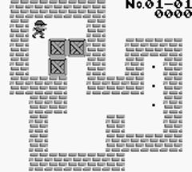
- **Working image links:** [snap](https://raw.githubusercontent.com/libretro-thumbnails/Nintendo_-_Game_Boy/master/Named_Snaps/Boxxle%20%28USA%2C%20Europe%29%20%28Rev%201%29.png) · [title](https://raw.githubusercontent.com/libretro-thumbnails/Nintendo_-_Game_Boy/master/Named_Titles/Boxxle%20%28USA%2C%20Europe%29%20%28Rev%201%29.png) · [boxart](https://raw.githubusercontent.com/libretro-thumbnails/Nintendo_-_Game_Boy/master/Named_Boxarts/Boxxle%20%28USA%2C%20Europe%29%20%28Rev%201%29.png)

### 🎮 Catrap
- **About:** A cute puzzle adventure with cats, monsters, and tricky rooms.
- **How it plays:** Move blocks and solve each room safely.
- **Getting started:** Use the rewind/undo feature constantly in early rooms so you can test ideas instead of restarting whole stages.
- **ByteBoi controls:** D-pad move, A/B jump/use, Start (Select+A) pause.
- **Animated GIF preview:** 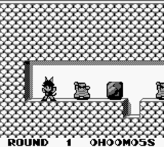
- **Working image links:** [snap](https://raw.githubusercontent.com/libretro-thumbnails/Nintendo_-_Game_Boy/master/Named_Snaps/Catrap%20%28USA%29.png) · [title](https://raw.githubusercontent.com/libretro-thumbnails/Nintendo_-_Game_Boy/master/Named_Titles/Catrap%20%28USA%29.png) · [boxart](https://raw.githubusercontent.com/libretro-thumbnails/Nintendo_-_Game_Boy/master/Named_Boxarts/Catrap%20%28USA%29.png)

### 🎮 Dr. Mario
- **About:** Match capsule colors to clear viruses.
- **How it plays:** Drop and rotate capsules to make color matches.
- **Getting started:** Clear bottom-row viruses first and keep one column open for vertical pills so the bottle never clogs.
- **ByteBoi controls:** D-pad move/drop, A/B rotate, Start (Select+A) pause.
- **Animated GIF preview:** 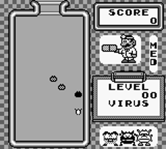
- **Working image links:** [snap](https://raw.githubusercontent.com/libretro-thumbnails/Nintendo_-_Game_Boy/master/Named_Snaps/Dr.%20Mario%20%28World%29%20%28Rev%201%29.png) · [title](https://raw.githubusercontent.com/libretro-thumbnails/Nintendo_-_Game_Boy/master/Named_Titles/Dr.%20Mario%20%28World%29%20%28Rev%201%29.png) · [boxart](https://raw.githubusercontent.com/libretro-thumbnails/Nintendo_-_Game_Boy/master/Named_Boxarts/Dr.%20Mario%20%28World%29.png)

### 🎮 Kwirk - He's A-maze-ing!
- **About:** A maze puzzle with a funny veggie hero.
- **How it plays:** Push objects and open paths to the exit.
- **Getting started:** Play Practice first to learn which blocks rotate or slide, then solve rooms by planning the final push backward.
- **ByteBoi controls:** D-pad move, A/B action, Start (Select+A) pause.
- **Animated GIF preview:** 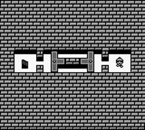
- **Working image links:** [snap](https://raw.githubusercontent.com/libretro-thumbnails/Nintendo_-_Game_Boy/master/Named_Snaps/Kwirk%20-%20He%27s%20A-maze-ing%21%20%28USA%2C%20Europe%29.png) · [title](https://raw.githubusercontent.com/libretro-thumbnails/Nintendo_-_Game_Boy/master/Named_Titles/Kwirk%20-%20He%27s%20A-maze-ing%21%20%28USA%2C%20Europe%29.png) · [boxart](https://raw.githubusercontent.com/libretro-thumbnails/Nintendo_-_Game_Boy/master/Named_Boxarts/Kwirk%20-%20He%27s%20A-maze-ing%21%20%28USA%2C%20Europe%29.png)

### 🎮 Mario's Picross
- **About:** Number puzzles that reveal hidden pixel pictures.
- **How it plays:** Use row/column clues to fill the correct squares.
- **Getting started:** Start with rows/columns where the clue equals the full length, then mark definite empty cells with X marks.
- **ByteBoi controls:** D-pad cursor, A/B fill/mark, Start (Select+A) pause.
- **Animated GIF preview:** 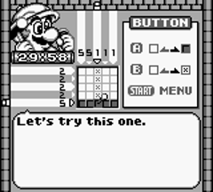
- **Working image links:** [snap](https://raw.githubusercontent.com/libretro-thumbnails/Nintendo_-_Game_Boy/master/Named_Snaps/Mario%27s%20Picross%20%28USA%2C%20Europe%29%20%28SGB%20Enhanced%29.png) · [title](https://raw.githubusercontent.com/libretro-thumbnails/Nintendo_-_Game_Boy/master/Named_Titles/Mario%27s%20Picross%20%28USA%2C%20Europe%29%20%28SGB%20Enhanced%29.png) · [boxart](https://raw.githubusercontent.com/libretro-thumbnails/Nintendo_-_Game_Boy/master/Named_Boxarts/Mario%27s%20Picross%20%28USA%2C%20Europe%29%20%28SGB%20Enhanced%29.png)

### 🎮 Mole Mania
- **About:** Muddy Mole solves action-puzzle stages to save his family.
- **How it plays:** Push objects, dig underground, and find the exit.
- **Getting started:** Practice switching above/below ground in stage 1 and use tunnels to move the black ball around enemies.
- **ByteBoi controls:** D-pad move, A/B pick/use, Start (Select+A) pause.
- **Animated GIF preview:** 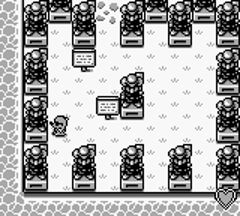
- **Working image links:** [snap](https://raw.githubusercontent.com/libretro-thumbnails/Nintendo_-_Game_Boy/master/Named_Snaps/Mole%20Mania%20%28USA%2C%20Europe%29%20%28SGB%20Enhanced%29.png) · [title](https://raw.githubusercontent.com/libretro-thumbnails/Nintendo_-_Game_Boy/master/Named_Titles/Mole%20Mania%20%28USA%2C%20Europe%29%20%28SGB%20Enhanced%29.png) · [boxart](https://raw.githubusercontent.com/libretro-thumbnails/Nintendo_-_Game_Boy/master/Named_Boxarts/Mole%20Mania%20%28USA%2C%20Europe%29%20%28SGB%20Enhanced%29.png)

### 🎮 Pokemon Yellow
- **About:** Classic Pokémon adventure with Pikachu as your buddy.
- **How it plays:** Explore, catch Pokémon, and win turn-based battles.
- **Getting started:** Before Brock, catch a Nidoran on Route 22 or a Caterpie in Viridian Forest so you are not relying only on Pikachu.
- **ByteBoi controls:** D-pad move/cursor, A confirm, B cancel, Start (Select+A) menu.
- **Animated GIF preview:** 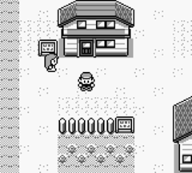
- **Working image links:** [snap](https://raw.githubusercontent.com/libretro-thumbnails/Nintendo_-_Game_Boy/master/Named_Snaps/Pokemon%20-%20Yellow%20Version%20-%20Special%20Pikachu%20Edition%20%28USA%2C%20Europe%29%20%28CGB%2BSGB%20Enhanced%29.png) · [title](https://raw.githubusercontent.com/libretro-thumbnails/Nintendo_-_Game_Boy/master/Named_Titles/Pokemon%20-%20Yellow%20Version%20-%20Special%20Pikachu%20Edition%20%28USA%2C%20Europe%29%20%28CGB%2BSGB%20Enhanced%29.png) · [boxart](https://raw.githubusercontent.com/libretro-thumbnails/Nintendo_-_Game_Boy/master/Named_Boxarts/Pokemon%20-%20Yellow%20Version%20-%20Special%20Pikachu%20Edition%20%28USA%2C%20Europe%29%20%28CGB%2BSGB%20Enhanced%29.png)

### 🎮 Solitaire FunPak
- **About:** A relaxing set of classic solo card games.
- **How it plays:** Move cards by suit/number rules to clear layouts.
- **Getting started:** In Klondike, prioritize flipping face-down cards before moving many cards to foundations; hidden cards create most wins.
- **ByteBoi controls:** D-pad cursor, A pick/place, B cancel, Start (Select+A) pause/menu.
- **Animated GIF preview:** 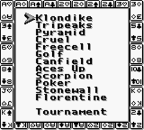
- **Working image links:** [snap](https://raw.githubusercontent.com/libretro-thumbnails/Nintendo_-_Game_Boy/master/Named_Snaps/Solitaire%20FunPak%20%28USA%2C%20Europe%29.png) · [title](https://raw.githubusercontent.com/libretro-thumbnails/Nintendo_-_Game_Boy/master/Named_Titles/Solitaire%20FunPak%20%28USA%2C%20Europe%29.png) · [boxart](https://raw.githubusercontent.com/libretro-thumbnails/Nintendo_-_Game_Boy/master/Named_Boxarts/Solitaire%20FunPak%20%28USA%2C%20Europe%29.png)

---

## 🟨 Game Boy Color (GBC)

### 🎮 Azure Dreams
- **About:** Climb a magical tower with monsters and town-building vibes.
- **How it plays:** Turn-based dungeon crawling with items and monster allies.
- **Getting started:** Store valuables in town before each tower run, because you restart at level 1 and can lose carried progress.
- **ByteBoi controls:** D-pad move/cursor, A confirm, B cancel, Start (Select+A) menu.
- **Animated GIF preview:** 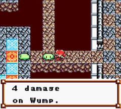
- **Working image links:** [snap](https://raw.githubusercontent.com/libretro-thumbnails/Nintendo_-_Game_Boy_Color/master/Named_Snaps/Azure%20Dreams%20%28USA%29%20%28SGB%20Enhanced%29%20%28GB%20Compatible%29.png) · [title](https://raw.githubusercontent.com/libretro-thumbnails/Nintendo_-_Game_Boy_Color/master/Named_Titles/Azure%20Dreams%20%28USA%29%20%28SGB%20Enhanced%29%20%28GB%20Compatible%29.png) · [boxart](https://raw.githubusercontent.com/libretro-thumbnails/Nintendo_-_Game_Boy_Color/master/Named_Boxarts/Azure%20Dreams%20%28USA%29%20%28SGB%20Enhanced%29%20%28GB%20Compatible%29.png)

### 🎮 Bomberman Quest
- **About:** Bomberman adventure with puzzle-like bomb stages and RPG touches.
- **How it plays:** Explore maps, place bombs, solve paths, battle enemies.
- **Getting started:** Clear every enemy in each early area to farm upgrades and money, then buy bomb power/range before boss fights.
- **ByteBoi controls:** D-pad move, A place/confirm, B cancel, Start (Select+A) menu.
- **Animated GIF preview:** 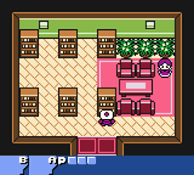
- **Working image links:** [snap](https://raw.githubusercontent.com/libretro-thumbnails/Nintendo_-_Game_Boy_Color/master/Named_Snaps/Bomberman%20Quest%20%28USA%29%20%28SGB%20Enhanced%29%20%28GB%20Compatible%29.png) · [title](https://raw.githubusercontent.com/libretro-thumbnails/Nintendo_-_Game_Boy_Color/master/Named_Titles/Bomberman%20Quest%20%28USA%29%20%28SGB%20Enhanced%29%20%28GB%20Compatible%29.png) · [boxart](https://raw.githubusercontent.com/libretro-thumbnails/Nintendo_-_Game_Boy_Color/master/Named_Boxarts/Bomberman%20Quest%20%28USA%29%20%28SGB%20Enhanced%29%20%28GB%20Compatible%29.png)

### 🎮 Dragon Warrior Monsters
- **About:** Raise and train monsters to become a champion tamer.
- **How it plays:** Turn-based battles, monster recruiting, and breeding.
- **Getting started:** Use meat to recruit monsters early and keep a 3-monster party with mixed attack types.
- **ByteBoi controls:** D-pad move/cursor, A confirm/talk, B back, Start (Select+A) menu.
- **Animated GIF preview:** 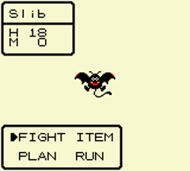
- **Working image links:** [snap](https://raw.githubusercontent.com/libretro-thumbnails/Nintendo_-_Game_Boy_Color/master/Named_Snaps/Dragon%20Warrior%20Monsters%20%28USA%2C%20Europe%29%20%28SGB%20Enhanced%29%20%28GB%20Compatible%29.png) · [title](https://raw.githubusercontent.com/libretro-thumbnails/Nintendo_-_Game_Boy_Color/master/Named_Titles/Dragon%20Warrior%20Monsters%20%28USA%2C%20Europe%29%20%28SGB%20Enhanced%29%20%28GB%20Compatible%29.png) · [boxart](https://raw.githubusercontent.com/libretro-thumbnails/Nintendo_-_Game_Boy_Color/master/Named_Boxarts/Dragon%20Warrior%20Monsters%20%28USA%2C%20Europe%29%20%28SGB%20Enhanced%29%20%28GB%20Compatible%29.png)

### 🎮 Dragon Warrior Monsters 2 - Cobi's Journey
- **About:** Big monster-raising quest across magical worlds.
- **How it plays:** Explore, collect monsters, fight turn-based battles.
- **Getting started:** Finish the first Traveler's Gates before grinding; early gate rewards give better monsters and skills quickly.
- **ByteBoi controls:** D-pad move/cursor, A confirm, B cancel, Start (Select+A) menu.
- **Animated GIF preview:** 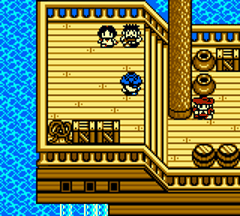
- **Working image links:** [snap](https://raw.githubusercontent.com/libretro-thumbnails/Nintendo_-_Game_Boy_Color/master/Named_Snaps/Dragon%20Warrior%20Monsters%202%20-%20Cobi%27s%20Journey%20%28USA%29%20%28SGB%20Enhanced%29%20%28GB%20Compatible%29.png) · [title](https://raw.githubusercontent.com/libretro-thumbnails/Nintendo_-_Game_Boy_Color/master/Named_Titles/Dragon%20Warrior%20Monsters%202%20-%20Cobi%27s%20Journey%20%28USA%29%20%28SGB%20Enhanced%29%20%28GB%20Compatible%29.png) · [boxart](https://raw.githubusercontent.com/libretro-thumbnails/Nintendo_-_Game_Boy_Color/master/Named_Boxarts/Dragon%20Warrior%20Monsters%202%20-%20Cobi%27s%20Journey%20%28USA%29%20%28SGB%20Enhanced%29%20%28GB%20Compatible%29.png)

### 🎮 Dragon Warrior Monsters 2 - Tara's Adventure
- **About:** Sister story path with monster team-building fun.
- **How it plays:** Turn-based strategy battles and world exploration.
- **Getting started:** Recruit aggressively with meat in first gates and fuse only after checking skill inheritance so key heals are kept.
- **ByteBoi controls:** D-pad move/cursor, A confirm, B cancel, Start (Select+A) menu.
- **Animated GIF preview:** 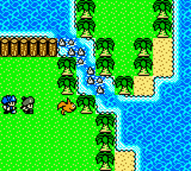
- **Working image links:** [snap](https://raw.githubusercontent.com/libretro-thumbnails/Nintendo_-_Game_Boy_Color/master/Named_Snaps/Dragon%20Warrior%20Monsters%202%20-%20Tara%27s%20Adventure%20%28USA%29%20%28SGB%20Enhanced%29%20%28GB%20Compatible%29.png) · [title](https://raw.githubusercontent.com/libretro-thumbnails/Nintendo_-_Game_Boy_Color/master/Named_Titles/Dragon%20Warrior%20Monsters%202%20-%20Tara%27s%20Adventure%20%28USA%29%20%28SGB%20Enhanced%29%20%28GB%20Compatible%29.png) · [boxart](https://raw.githubusercontent.com/libretro-thumbnails/Nintendo_-_Game_Boy_Color/master/Named_Boxarts/Dragon%20Warrior%20Monsters%202%20-%20Tara%27s%20Adventure%20%28USA%29%20%28SGB%20Enhanced%29%20%28GB%20Compatible%29.png)

### 🎮 Harvest Moon GBC
- **About:** Cozy farming life game with crops and daily planning.
- **How it plays:** Plant, water, harvest, sell, and improve your farm.
- **Getting started:** On day 1, plant mostly turnips and water daily; fast harvests snowball your money for more seeds.
- **ByteBoi controls:** D-pad move, A use tool/confirm, B back, Start (Select+A) menu.
- **Animated GIF preview:** 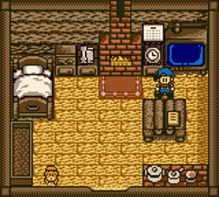
- **Working image links:** [snap](https://raw.githubusercontent.com/libretro-thumbnails/Nintendo_-_Game_Boy_Color/master/Named_Snaps/Harvest%20Moon%20GBC%20%28USA%29%20%28SGB%20Enhanced%29%20%28GB%20Compatible%29.png) · [title](https://raw.githubusercontent.com/libretro-thumbnails/Nintendo_-_Game_Boy_Color/master/Named_Titles/Harvest%20Moon%20GBC%20%28USA%29%20%28SGB%20Enhanced%29%20%28GB%20Compatible%29.png) · [boxart](https://raw.githubusercontent.com/libretro-thumbnails/Nintendo_-_Game_Boy_Color/master/Named_Boxarts/Harvest%20Moon%20GBC%20%28USA%29%20%28SGB%20Enhanced%29%20%28GB%20Compatible%29.png)

### 🎮 Harvest Moon 2 GBC
- **About:** Another peaceful farm adventure with more planning choices.
- **How it plays:** Manage days, crops, money, and upgrades.
- **Getting started:** Clear a small efficient field first, then buy only the season's fastest crop until tools can be upgraded.
- **ByteBoi controls:** D-pad move, A use tool/confirm, B back, Start (Select+A) menu.
- **Animated GIF preview:** 
- **Working image links:** [snap](https://raw.githubusercontent.com/libretro-thumbnails/Nintendo_-_Game_Boy_Color/master/Named_Snaps/Harvest%20Moon%202%20GBC%20%28USA%29%20%28SGB%20Enhanced%29%20%28GB%20Compatible%29.png) · [title](https://raw.githubusercontent.com/libretro-thumbnails/Nintendo_-_Game_Boy_Color/master/Named_Titles/Harvest%20Moon%202%20GBC%20%28USA%29%20%28SGB%20Enhanced%29%20%28GB%20Compatible%29.png) · [boxart](https://raw.githubusercontent.com/libretro-thumbnails/Nintendo_-_Game_Boy_Color/master/Named_Boxarts/Harvest%20Moon%202%20GBC%20%28USA%29%20%28SGB%20Enhanced%29%20%28GB%20Compatible%29.png)

### 🎮 Heroes of Might and Magic
- **About:** Fantasy strategy game with heroes, armies, and map control.
- **How it plays:** Turn-based exploration, recruiting, and tactical battles.
- **Getting started:** Capture your nearest mine on turn 1 and keep your strongest stack with one main hero for safer early battles.
- **ByteBoi controls:** D-pad cursor, A confirm/select, B cancel, Start (Select+A) menu.
- **Animated GIF preview:** 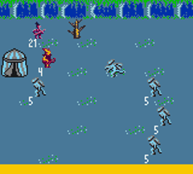
- **Working image links:** [snap](https://raw.githubusercontent.com/libretro-thumbnails/Nintendo_-_Game_Boy_Color/master/Named_Snaps/Heroes%20of%20Might%20and%20Magic%20%28USA%29%20%28En%2CFr%2CDe%29.png) · [title](https://raw.githubusercontent.com/libretro-thumbnails/Nintendo_-_Game_Boy_Color/master/Named_Titles/Heroes%20of%20Might%20and%20Magic%20%28USA%29%20%28En%2CFr%2CDe%29.png) · [boxart](https://raw.githubusercontent.com/libretro-thumbnails/Nintendo_-_Game_Boy_Color/master/Named_Boxarts/Heroes%20of%20Might%20and%20Magic%20%28USA%29%20%28En%2CFr%2CDe%29.png)

### 🎮 The Legend of Zelda: Link's Awakening DX
- **About:** Explore a mysterious island in a story-rich Zelda adventure.
- **How it plays:** Solve puzzles, fight enemies, and clear dungeons.
- **Getting started:** After getting the sword and shield, rush Tail Cave for Roc's Feather; that jump opens many easy heart-piece pickups.
- **ByteBoi controls:** D-pad move, A/B item+sword, Start (Select+A) inventory/menu.
- **Animated GIF preview:** 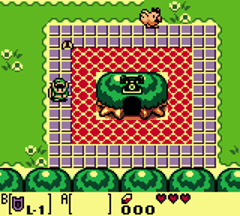
- **Working image links:** [snap](https://raw.githubusercontent.com/libretro-thumbnails/Nintendo_-_Game_Boy_Color/master/Named_Snaps/Legend%20of%20Zelda%2C%20The%20-%20Link%27s%20Awakening%20DX%20%28USA%2C%20Europe%29%20%28SGB%20Enhanced%29%20%28GB%20Compatible%29.png) · [title](https://raw.githubusercontent.com/libretro-thumbnails/Nintendo_-_Game_Boy_Color/master/Named_Titles/Legend%20of%20Zelda%2C%20The%20-%20Link%27s%20Awakening%20DX%20%28USA%2C%20Europe%29%20%28SGB%20Enhanced%29%20%28GB%20Compatible%29.png) · [boxart](https://raw.githubusercontent.com/libretro-thumbnails/Nintendo_-_Game_Boy_Color/master/Named_Boxarts/Legend%20of%20Zelda%2C%20The%20-%20Link%27s%20Awakening%20DX%20%28USA%2C%20Europe%29%20%28SGB%20Enhanced%29%20%28GB%20Compatible%29.png)

### 🎮 The Legend of Zelda: Oracle of Ages
- **About:** Time-travel Zelda story focused on puzzles.
- **How it plays:** Switch between past/present to solve world and dungeon puzzles.
- **Getting started:** When stuck, switch time eras immediately and re-check the same screen; most early puzzles hinge on past/present changes.
- **ByteBoi controls:** D-pad move, A/B item+sword, Start (Select+A) inventory/menu.
- **Animated GIF preview:** 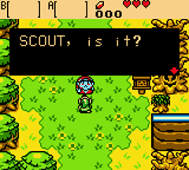
- **Working image links:** [snap](https://raw.githubusercontent.com/libretro-thumbnails/Nintendo_-_Game_Boy_Color/master/Named_Snaps/Legend%20of%20Zelda%2C%20The%20-%20Oracle%20of%20Ages%20%28USA%2C%20Australia%29.png) · [title](https://raw.githubusercontent.com/libretro-thumbnails/Nintendo_-_Game_Boy_Color/master/Named_Titles/Legend%20of%20Zelda%2C%20The%20-%20Oracle%20of%20Ages%20%28USA%2C%20Australia%29.png) · [boxart](https://raw.githubusercontent.com/libretro-thumbnails/Nintendo_-_Game_Boy_Color/master/Named_Boxarts/Legend%20of%20Zelda%2C%20The%20-%20Oracle%20of%20Ages%20%28USA%2C%20Australia%29.png)

### 🎮 The Legend of Zelda: Oracle of Seasons
- **About:** Zelda adventure where you change seasons to open paths.
- **How it plays:** Real-time action with season-based puzzle solving.
- **Getting started:** Test each season stump in new zones; changing seasons often reveals hidden bridges, vines, or cave entrances.
- **ByteBoi controls:** D-pad move, A/B item+sword, Start (Select+A) inventory/menu.
- **Animated GIF preview:** 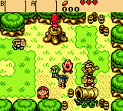
- **Working image links:** [snap](https://raw.githubusercontent.com/libretro-thumbnails/Nintendo_-_Game_Boy_Color/master/Named_Snaps/Legend%20of%20Zelda%2C%20The%20-%20Oracle%20of%20Seasons%20%28USA%2C%20Australia%29.png) · [title](https://raw.githubusercontent.com/libretro-thumbnails/Nintendo_-_Game_Boy_Color/master/Named_Titles/Legend%20of%20Zelda%2C%20The%20-%20Oracle%20of%20Seasons%20%28USA%2C%20Australia%29.png) · [boxart](https://raw.githubusercontent.com/libretro-thumbnails/Nintendo_-_Game_Boy_Color/master/Named_Boxarts/Legend%20of%20Zelda%2C%20The%20-%20Oracle%20of%20Seasons%20%28USA%2C%20Australia%29.png)

### 🎮 Lemmings & Oh No! More Lemmings
- **About:** Guide tiny lemmings safely to exits.
- **How it plays:** Assign jobs like digger/builder/blocker to solve each level.
- **Getting started:** Lower release rate and place an early blocker at the first hazard so you can test builder/digger routes safely.
- **ByteBoi controls:** D-pad cursor, A assign skill, B cancel, Start (Select+A) pause.
- **Animated GIF preview:** 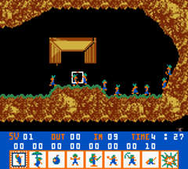
- **Working image links:** [snap](https://raw.githubusercontent.com/libretro-thumbnails/Nintendo_-_Game_Boy_Color/master/Named_Snaps/Lemmings%20_%20Oh%20No%21%20More%20Lemmings%20%28USA%29.png) · [title](https://raw.githubusercontent.com/libretro-thumbnails/Nintendo_-_Game_Boy_Color/master/Named_Titles/Lemmings%20_%20Oh%20No%21%20More%20Lemmings%20%28USA%29.png) · [boxart](https://raw.githubusercontent.com/libretro-thumbnails/Nintendo_-_Game_Boy_Color/master/Named_Boxarts/Lemmings%20_%20Oh%20No%21%20More%20Lemmings%20%28USA%29.png)

### 🎮 Lufia - The Legend Returns
- **About:** Turn-based fantasy RPG with heroes and treasure quests.
- **How it plays:** Explore dungeons and battle with tactical party setup.
- **Getting started:** Set your toughest fighters in front row and keep IP skills for boss bursts instead of random encounters.
- **ByteBoi controls:** D-pad move/cursor, A confirm/talk, B back, Start (Select+A) menu.
- **Animated GIF preview:** 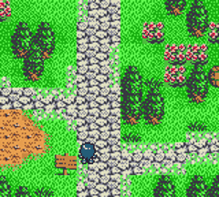
- **Working image links:** [snap](https://raw.githubusercontent.com/libretro-thumbnails/Nintendo_-_Game_Boy_Color/master/Named_Snaps/Lufia%20-%20The%20Legend%20Returns%20%28USA%29.png) · [title](https://raw.githubusercontent.com/libretro-thumbnails/Nintendo_-_Game_Boy_Color/master/Named_Titles/Lufia%20-%20The%20Legend%20Returns%20%28USA%29.png) · [boxart](https://raw.githubusercontent.com/libretro-thumbnails/Nintendo_-_Game_Boy_Color/master/Named_Boxarts/Lufia%20-%20The%20Legend%20Returns%20%28USA%29.png)

### 🎮 Metal Walker
- **About:** Sci-fi RPG with robot battles and cool mechanics.
- **How it plays:** Battles play like strategic pinball with positioning.
- **Getting started:** In early battles, bank shots off walls to hit enemy cores twice and collect scrap for core upgrades after each fight.
- **ByteBoi controls:** D-pad move/cursor, A confirm, B cancel, Start (Select+A) menu.
- **Animated GIF preview:** 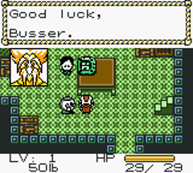
- **Working image links:** [snap](https://raw.githubusercontent.com/libretro-thumbnails/Nintendo_-_Game_Boy_Color/master/Named_Snaps/Metal%20Walker%20%28USA%29%20%28GB%20Compatible%29.png) · [title](https://raw.githubusercontent.com/libretro-thumbnails/Nintendo_-_Game_Boy_Color/master/Named_Titles/Metal%20Walker%20%28USA%29%20%28GB%20Compatible%29.png) · [boxart](https://raw.githubusercontent.com/libretro-thumbnails/Nintendo_-_Game_Boy_Color/master/Named_Boxarts/Metal%20Walker%20%28USA%29%20%28GB%20Compatible%29.png)

### 🎮 Pokemon Crystal
- **About:** Big Johto Pokémon journey with gyms, rivals, and legendary monsters.
- **How it plays:** Catch/train Pokémon and battle turn-by-turn.
- **Getting started:** Catch Bellsprout on Route 31 and train it for Falkner; early type coverage makes the first gym much easier.
- **ByteBoi controls:** D-pad move/cursor, A confirm/talk, B cancel/run, Start (Select+A) menu.
- **Animated GIF preview:** 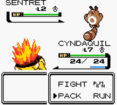
- **Working image links:** [snap](https://raw.githubusercontent.com/libretro-thumbnails/Nintendo_-_Game_Boy_Color/master/Named_Snaps/Pokemon%20-%20Crystal%20Version%20%28USA%2C%20Europe%29%20%28Rev%201%29.png) · [title](https://raw.githubusercontent.com/libretro-thumbnails/Nintendo_-_Game_Boy_Color/master/Named_Titles/Pokemon%20-%20Crystal%20Version%20%28USA%2C%20Europe%29%20%28Rev%201%29.png) · [boxart](https://raw.githubusercontent.com/libretro-thumbnails/Nintendo_-_Game_Boy_Color/master/Named_Boxarts/Pokemon%20-%20Crystal%20Version%20%28USA%29.png)

### 🎮 Pokemon Puzzle Challenge
- **About:** Pokémon-themed block puzzle action with chain combos.
- **How it plays:** Swap blocks to match colors and trigger combo clears.
- **Getting started:** Practice simple 2-chains in Puzzle University first, then keep your stack low before chasing big combos.
- **ByteBoi controls:** D-pad cursor, A swap, B back, Start (Select+A) pause.
- **Animated GIF preview:** 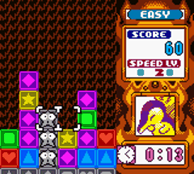
- **Working image links:** [snap](https://raw.githubusercontent.com/libretro-thumbnails/Nintendo_-_Game_Boy_Color/master/Named_Snaps/Pokemon%20Puzzle%20Challenge%20%28USA%2C%20Australia%29.png) · [title](https://raw.githubusercontent.com/libretro-thumbnails/Nintendo_-_Game_Boy_Color/master/Named_Titles/Pokemon%20Puzzle%20Challenge%20%28USA%2C%20Australia%29.png) · [boxart](https://raw.githubusercontent.com/libretro-thumbnails/Nintendo_-_Game_Boy_Color/master/Named_Boxarts/Pokemon%20Puzzle%20Challenge%20%28USA%2C%20Australia%29.png)

### 🎮 Pokemon Trading Card Game
- **About:** Story-driven card battle RPG in the Pokémon world.
- **How it plays:** Turn-based duels using energy, attacks, and trainer cards.
- **Getting started:** Choose one starter deck and upgrade it first; keep enough basic Energy so your main attacker can attack by turn 2.
- **ByteBoi controls:** D-pad cursor, A confirm/select card, B cancel, Start (Select+A) menu.
- **Animated GIF preview:** 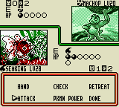
- **Working image links:** [snap](https://raw.githubusercontent.com/libretro-thumbnails/Nintendo_-_Game_Boy_Color/master/Named_Snaps/Pokemon%20Trading%20Card%20Game%20%28USA%2C%20Australia%29%20%28SGB%20Enhanced%29%20%28GB%20Compatible%29.png) · [title](https://raw.githubusercontent.com/libretro-thumbnails/Nintendo_-_Game_Boy_Color/master/Named_Titles/Pokemon%20Trading%20Card%20Game%20%28USA%2C%20Australia%29%20%28SGB%20Enhanced%29%20%28GB%20Compatible%29.png) · [boxart](https://raw.githubusercontent.com/libretro-thumbnails/Nintendo_-_Game_Boy_Color/master/Named_Boxarts/Pokemon%20Trading%20Card%20Game%20%28USA%2C%20Australia%29%20%28SGB%20Enhanced%29%20%28GB%20Compatible%29.png)

### 🎮 Puzzle Master
- **About:** Logic puzzle collection with lots of brainy mini-challenges.
- **How it plays:** Solve one-screen logic tasks and pattern puzzles.
- **Getting started:** Sort edge pieces first and use color clusters before trying tiny details; this speeds up every jigsaw dramatically.
- **ByteBoi controls:** D-pad cursor, A place/confirm, B cancel, Start (Select+A) menu.
- **Animated GIF preview:** 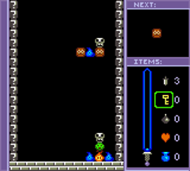
- **Working image links:** [snap](https://raw.githubusercontent.com/libretro-thumbnails/Nintendo_-_Game_Boy_Color/master/Named_Snaps/Puzzle%20Master%20%28USA%29%20%28GB%20Compatible%29.png) · [title](https://raw.githubusercontent.com/libretro-thumbnails/Nintendo_-_Game_Boy_Color/master/Named_Titles/Puzzle%20Master%20%28USA%29%20%28GB%20Compatible%29.png) · [boxart](https://raw.githubusercontent.com/libretro-thumbnails/Nintendo_-_Game_Boy_Color/master/Named_Boxarts/Puzzle%20Master%20%28USA%29%20%28GB%20Compatible%29.png)

### 🎮 Survival Kids
- **About:** Island survival adventure with choices and multiple endings.
- **How it plays:** Gather food/water, craft tools, and manage health.
- **Getting started:** Day 1 priority is fire plus a shelter near fresh water; explore farther only after hunger/thirst are stable.
- **ByteBoi controls:** D-pad move/cursor, A use/confirm, B cancel, Start (Select+A) menu.
- **Animated GIF preview:** 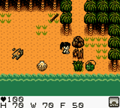
- **Working image links:** [snap](https://raw.githubusercontent.com/libretro-thumbnails/Nintendo_-_Game_Boy_Color/master/Named_Snaps/Survival%20Kids%20%28USA%29%20%28SGB%20Enhanced%29%20%28GB%20Compatible%29.png) · [title](https://raw.githubusercontent.com/libretro-thumbnails/Nintendo_-_Game_Boy_Color/master/Named_Titles/Survival%20Kids%20%28USA%29%20%28SGB%20Enhanced%29%20%28GB%20Compatible%29.png) · [boxart](https://raw.githubusercontent.com/libretro-thumbnails/Nintendo_-_Game_Boy_Color/master/Named_Boxarts/Survival%20Kids%20%28USA%29%20%28SGB%20Enhanced%29%20%28GB%20Compatible%29.png)

### 🎮 Tetris DX
- **About:** Classic block puzzle game with smooth GBC color style.
- **How it plays:** Place falling pieces to clear horizontal lines.
- **Getting started:** Keep one side column open for I-pieces and favor clean singles/doubles over risky high stacks early on.
- **ByteBoi controls:** D-pad move, A/B rotate, Start (Select+A) pause.
- **Animated GIF preview:** 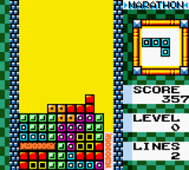
- **Working image links:** [snap](https://raw.githubusercontent.com/libretro-thumbnails/Nintendo_-_Game_Boy_Color/master/Named_Snaps/Tetris%20DX%20%28World%29%20%28SGB%20Enhanced%29%20%28GB%20Compatible%29.png) · [title](https://raw.githubusercontent.com/libretro-thumbnails/Nintendo_-_Game_Boy_Color/master/Named_Titles/Tetris%20DX%20%28World%29%20%28SGB%20Enhanced%29%20%28GB%20Compatible%29.png) · [boxart](https://raw.githubusercontent.com/libretro-thumbnails/Nintendo_-_Game_Boy_Color/master/Named_Boxarts/Tetris%20DX%20%28World%29%20%28SGB%20Enhanced%29%20%28GB%20Compatible%29.png)

### 🎮 Warlocked
- **About:** Rare real-time strategy game on GBC with fantasy armies.
- **How it plays:** Build units, gather resources, and command battles.
- **Getting started:** Queue workers on wood and gold immediately, then build army production early so you do not fall behind the AI.
- **ByteBoi controls:** D-pad cursor, A select/confirm, B cancel, Start (Select+A) menu.
- **Animated GIF preview:** 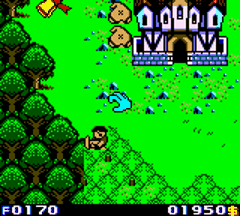
- **Working image links:** [snap](https://raw.githubusercontent.com/libretro-thumbnails/Nintendo_-_Game_Boy_Color/master/Named_Snaps/Warlocked%20%28USA%29.png) · [title](https://raw.githubusercontent.com/libretro-thumbnails/Nintendo_-_Game_Boy_Color/master/Named_Titles/Warlocked%20%28USA%29.png) · [boxart](https://raw.githubusercontent.com/libretro-thumbnails/Nintendo_-_Game_Boy_Color/master/Named_Boxarts/Warlocked%20%28USA%29.png)

### 🎮 Yu-Gi-Oh! - Dark Duel Stories
- **About:** Card-battle adventure with deck strategy and duels.
- **How it plays:** Turn-based monster/spell/trap duels.
- **Getting started:** Spend early star chips on deck capacity first, then build around reliable 4-star monsters for consistent opening turns.
- **ByteBoi controls:** D-pad cursor, A confirm/play, B cancel, Start (Select+A) menu.
- **Animated GIF preview:** 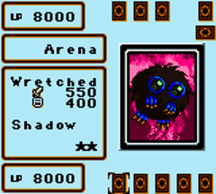
- **Working image links:** [snap](https://raw.githubusercontent.com/libretro-thumbnails/Nintendo_-_Game_Boy_Color/master/Named_Snaps/Yu-Gi-Oh%21%20-%20Dark%20Duel%20Stories%20%28USA%29.png) · [title](https://raw.githubusercontent.com/libretro-thumbnails/Nintendo_-_Game_Boy_Color/master/Named_Titles/Yu-Gi-Oh%21%20-%20Dark%20Duel%20Stories%20%28USA%29.png) · [boxart](https://raw.githubusercontent.com/libretro-thumbnails/Nintendo_-_Game_Boy_Color/master/Named_Boxarts/Yu-Gi-Oh%21%20-%20Dark%20Duel%20Stories%20%28USA%29.png)

---

## 🔵 NES

### 🎮 Adventures of Lolo
- **About:** Room-by-room brain puzzles in a cute castle world.
- **How it plays:** Collect hearts, avoid enemies, unlock chest, reach exit.
- **Getting started:** Collect all hearts before opening the chest, and use blocks to break Medusa line-of-sight before moving.
- **ByteBoi controls:** D-pad move, A action, B back, Start (Select+A) pause.
- **Animated GIF preview:** 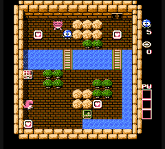
- **Working image links:** [snap](https://raw.githubusercontent.com/libretro-thumbnails/Nintendo_-_Nintendo_Entertainment_System/master/Named_Snaps/Adventures%20of%20Lolo%20%28USA%29.png) · [title](https://raw.githubusercontent.com/libretro-thumbnails/Nintendo_-_Nintendo_Entertainment_System/master/Named_Titles/Adventures%20of%20Lolo%20%28USA%29.png) · [boxart](https://raw.githubusercontent.com/libretro-thumbnails/Nintendo_-_Nintendo_Entertainment_System/master/Named_Boxarts/Adventures%20of%20Lolo%20%28USA%29.png)

### 🎮 Adventures of Lolo 2
- **About:** More challenging Lolo puzzle rooms with new twists.
- **How it plays:** Same puzzle formula with harder room logic.
- **Getting started:** Save limited heart-framers for enemies that block the exit path; wasting one can make a room impossible.
- **ByteBoi controls:** D-pad move, A action, B back, Start (Select+A) pause.
- **Animated GIF preview:** 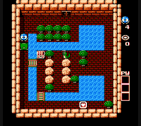
- **Working image links:** [snap](https://raw.githubusercontent.com/libretro-thumbnails/Nintendo_-_Nintendo_Entertainment_System/master/Named_Snaps/Adventures%20of%20Lolo%202%20%28USA%29%20%28Virtual%20Console%29.png) · [title](https://raw.githubusercontent.com/libretro-thumbnails/Nintendo_-_Nintendo_Entertainment_System/master/Named_Titles/Adventures%20of%20Lolo%202%20%28USA%29%20%28Virtual%20Console%29.png) · [boxart](https://raw.githubusercontent.com/libretro-thumbnails/Nintendo_-_Nintendo_Entertainment_System/master/Named_Boxarts/Adventures%20of%20Lolo%202%20%28USA%29%20%28Virtual%20Console%29.png)

### 🎮 Adventures of Lolo 3
- **About:** Third Lolo entry with fresh puzzle mechanics.
- **How it plays:** Solve puzzle rooms with smart movement and item use.
- **Getting started:** Scout both room sides before committing to bridge/egg uses; many puzzles punish one-way item usage.
- **ByteBoi controls:** D-pad move, A action, B back, Start (Select+A) pause.
- **Animated GIF preview:** 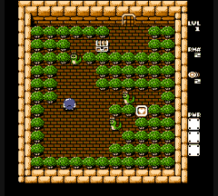
- **Working image links:** [snap](https://raw.githubusercontent.com/libretro-thumbnails/Nintendo_-_Nintendo_Entertainment_System/master/Named_Snaps/Adventures%20of%20Lolo%203%20%28USA%29.png) · [title](https://raw.githubusercontent.com/libretro-thumbnails/Nintendo_-_Nintendo_Entertainment_System/master/Named_Titles/Adventures%20of%20Lolo%203%20%28USA%29.png) · [boxart](https://raw.githubusercontent.com/libretro-thumbnails/Nintendo_-_Nintendo_Entertainment_System/master/Named_Boxarts/Adventures%20of%20Lolo%203%20%28USA%29.png)

### 🎮 Battle Chess
- **About:** Chess with fun battle animations.
- **How it plays:** Classic turn-based chess strategy.
- **Getting started:** Use a simple opening: develop knights and bishops first, castle early, and avoid early queen attacks.
- **ByteBoi controls:** D-pad cursor, A select/confirm, B cancel, Start (Select+A) options.
- **Animated GIF preview:** 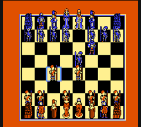
- **Working image links:** [snap](https://raw.githubusercontent.com/libretro-thumbnails/Nintendo_-_Nintendo_Entertainment_System/master/Named_Snaps/Battle%20Chess%20%28USA%29.png) · [title](https://raw.githubusercontent.com/libretro-thumbnails/Nintendo_-_Nintendo_Entertainment_System/master/Named_Titles/Battle%20Chess%20%28USA%29.png) · [boxart](https://raw.githubusercontent.com/libretro-thumbnails/Nintendo_-_Nintendo_Entertainment_System/master/Named_Boxarts/Battle%20Chess%20%28USA%29.png)

### 🎮 The Chessmaster
- **About:** Traditional chess with training-friendly pacing.
- **How it plays:** Turn-by-turn strategy and checkmate planning.
- **Getting started:** Start with easier AI and play openings that control the center (e4/d4) before launching attacks.
- **ByteBoi controls:** D-pad cursor, A select/confirm, B cancel, Start (Select+A) options.
- **Animated GIF preview:** 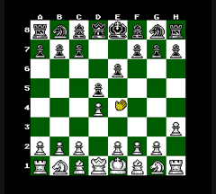
- **Working image links:** [snap](https://raw.githubusercontent.com/libretro-thumbnails/Nintendo_-_Nintendo_Entertainment_System/master/Named_Snaps/Chessmaster%2C%20The%20%28USA%29.png) · [title](https://raw.githubusercontent.com/libretro-thumbnails/Nintendo_-_Nintendo_Entertainment_System/master/Named_Titles/Chessmaster%2C%20The%20%28USA%29.png) · [boxart](https://raw.githubusercontent.com/libretro-thumbnails/Nintendo_-_Nintendo_Entertainment_System/master/Named_Boxarts/Chessmaster%2C%20The%20%28USA%29.png)

### 🎮 Desert Commander
- **About:** Turn-based military strategy in desert battles.
- **How it plays:** Move units, capture positions, and attack smartly.
- **Getting started:** Capture nearby cities quickly with infantry to boost income, then move tanks/artillery together as one front.
- **ByteBoi controls:** D-pad cursor, A choose/move, B cancel, Start (Select+A) menu.
- **Animated GIF preview:** 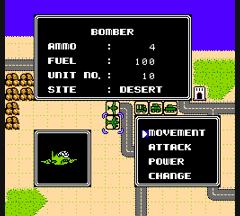
- **Working image links:** [snap](https://raw.githubusercontent.com/libretro-thumbnails/Nintendo_-_Nintendo_Entertainment_System/master/Named_Snaps/Desert%20Commander%20%28USA%29.png) · [title](https://raw.githubusercontent.com/libretro-thumbnails/Nintendo_-_Nintendo_Entertainment_System/master/Named_Titles/Desert%20Commander%20%28USA%29.png) · [boxart](https://raw.githubusercontent.com/libretro-thumbnails/Nintendo_-_Nintendo_Entertainment_System/master/Named_Boxarts/Desert%20Commander%20%28USA%29.png)

### 🎮 Dr. Mario
- **About:** Virus-clearing puzzle classic.
- **How it plays:** Drop pills to make color matches and clear viruses.
- **Getting started:** Target viruses at the bottom first and avoid stacking mismatched halves high in the bottle.
- **ByteBoi controls:** D-pad move/drop, A/B rotate, Start (Select+A) pause.
- **Animated GIF preview:** 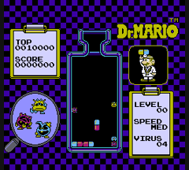
- **Working image links:** [snap](https://raw.githubusercontent.com/libretro-thumbnails/Nintendo_-_Nintendo_Entertainment_System/master/Named_Snaps/Dr.%20Mario%20%28Japan%2C%20USA%29%20%28En%29%20%28Rev%201%29.png) · [title](https://raw.githubusercontent.com/libretro-thumbnails/Nintendo_-_Nintendo_Entertainment_System/master/Named_Titles/Dr.%20Mario%20%28Japan%2C%20USA%29%20%28En%29.png) · [boxart](https://raw.githubusercontent.com/libretro-thumbnails/Nintendo_-_Nintendo_Entertainment_System/master/Named_Boxarts/Dr.%20Mario%20%28Japan%2C%20USA%29.png)

### 🎮 Genghis Khan
- **About:** Grand strategy game about building a huge empire.
- **How it plays:** Turn-based management of cities, armies, and politics.
- **Getting started:** Keep frontier provinces led by high-war officers and maintain food reserves before expanding.
- **ByteBoi controls:** D-pad cursor/map, A confirm, B back, Start (Select+A) menu.
- **Animated GIF preview:** 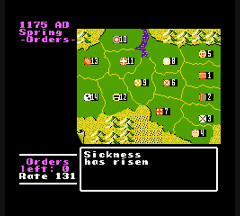
- **Working image links:** [snap](https://raw.githubusercontent.com/libretro-thumbnails/Nintendo_-_Nintendo_Entertainment_System/master/Named_Snaps/Genghis%20Khan%20%28USA%29.png) · [title](https://raw.githubusercontent.com/libretro-thumbnails/Nintendo_-_Nintendo_Entertainment_System/master/Named_Titles/Genghis%20Khan%20%28USA%29.png) · [boxart](https://raw.githubusercontent.com/libretro-thumbnails/Nintendo_-_Nintendo_Entertainment_System/master/Named_Boxarts/Genghis%20Khan%20%28USA%29.png)

### 🎮 Kirby's Adventure
- **About:** Bright platform adventure where Kirby copies powers.
- **How it plays:** Jump, inhale enemies, and use copied abilities.
- **Getting started:** In early stages, test copy abilities (Sword, Beam, Fire) and keep the one that matches the next boss.
- **ByteBoi controls:** D-pad move, A jump, B inhale/power, Start (Select+A) pause.
- **Animated GIF preview:** 
- **Working image links:** [snap](https://raw.githubusercontent.com/libretro-thumbnails/Nintendo_-_Nintendo_Entertainment_System/master/Named_Snaps/Kirby%27s%20Adventure%20%28USA%29.png) · [title](https://raw.githubusercontent.com/libretro-thumbnails/Nintendo_-_Nintendo_Entertainment_System/master/Named_Titles/Kirby%27s%20Adventure%20%28USA%29.png) · [boxart](https://raw.githubusercontent.com/libretro-thumbnails/Nintendo_-_Nintendo_Entertainment_System/master/Named_Boxarts/Kirby%27s%20Adventure%20%28USA%29.png)

### 🎮 Nobunaga's Ambition
- **About:** Historical strategy game about uniting feudal Japan.
- **How it plays:** Turn-based city management, diplomacy, and warfare.
- **Getting started:** Invest first turns in rice and commerce, then attack only after your clan can sustain longer campaigns.
- **ByteBoi controls:** D-pad cursor/map, A confirm, B back, Start (Select+A) menu.
- **Animated GIF preview:** 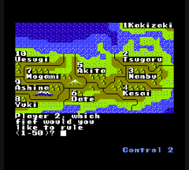
- **Working image links:** [snap](https://raw.githubusercontent.com/libretro-thumbnails/Nintendo_-_Nintendo_Entertainment_System/master/Named_Snaps/Nobunaga%27s%20Ambition%20%28USA%29.png) · [title](https://raw.githubusercontent.com/libretro-thumbnails/Nintendo_-_Nintendo_Entertainment_System/master/Named_Titles/Nobunaga%27s%20Ambition%20%28USA%29.png) · [boxart](https://raw.githubusercontent.com/libretro-thumbnails/Nintendo_-_Nintendo_Entertainment_System/master/Named_Boxarts/Nobunaga%27s%20Ambition%20%28USA%29.png)

### 🎮 Pipe Dream
- **About:** Quick puzzle game where you build pipe routes before flow starts.
- **How it plays:** Place pipe pieces fast to guide goo through a long path.
- **Getting started:** Build from the center outward and leave escape space for awkward pieces so flooz never dead-ends.
- **ByteBoi controls:** D-pad cursor, A place, B cancel, Start (Select+A) pause.
- **Animated GIF preview:** 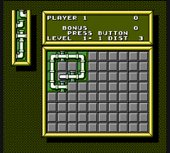
- **Working image links:** [snap](https://raw.githubusercontent.com/libretro-thumbnails/Nintendo_-_Nintendo_Entertainment_System/master/Named_Snaps/Pipe%20Dream%20%28USA%29.png) · [title](https://raw.githubusercontent.com/libretro-thumbnails/Nintendo_-_Nintendo_Entertainment_System/master/Named_Titles/Pipe%20Dream%20%28USA%29.png) · [boxart](https://raw.githubusercontent.com/libretro-thumbnails/Nintendo_-_Nintendo_Entertainment_System/master/Named_Boxarts/Pipe%20Dream%20%28USA%29.png)

### 🎮 Rampart
- **About:** Mix of strategy, puzzle, and cannon defense.
- **How it plays:** Fire cannons, then rebuild walls between attack rounds.
- **Getting started:** After each attack wave, close the biggest wall breach first, then place cannons for overlapping coverage.
- **ByteBoi controls:** D-pad cursor, A place/fire, B cancel, Start (Select+A) menu.
- **Animated GIF preview:** 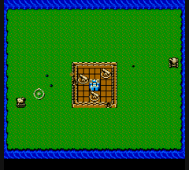
- **Working image links:** [snap](https://raw.githubusercontent.com/libretro-thumbnails/Nintendo_-_Nintendo_Entertainment_System/master/Named_Snaps/Rampart%20%28USA%29%20%28Jaleco%29.png) · [title](https://raw.githubusercontent.com/libretro-thumbnails/Nintendo_-_Nintendo_Entertainment_System/master/Named_Titles/Rampart%20%28USA%29%20%28Jaleco%29.png) · [boxart](https://raw.githubusercontent.com/libretro-thumbnails/Nintendo_-_Nintendo_Entertainment_System/master/Named_Boxarts/Rampart%20%28USA%29%20%28Jaleco%29.png)

### 🎮 Romance of the Three Kingdoms II
- **About:** Deep strategy story in ancient China.
- **How it plays:** Turn-based kingdom management and military planning.
- **Getting started:** Reward officers regularly to keep loyalty high; low loyalty hurts command and risks defections.
- **ByteBoi controls:** D-pad cursor/map, A confirm, B back, Start (Select+A) menu.
- **Animated GIF preview:** 
- **Working image links:** [snap](https://raw.githubusercontent.com/libretro-thumbnails/Nintendo_-_Nintendo_Entertainment_System/master/Named_Snaps/Romance%20of%20the%20Three%20Kingdoms%20II%20%28USA%29.png) · [title](https://raw.githubusercontent.com/libretro-thumbnails/Nintendo_-_Nintendo_Entertainment_System/master/Named_Titles/Romance%20of%20the%20Three%20Kingdoms%20II%20%28USA%29.png) · [boxart](https://raw.githubusercontent.com/libretro-thumbnails/Nintendo_-_Nintendo_Entertainment_System/master/Named_Boxarts/Romance%20of%20the%20Three%20Kingdoms%20II%20%28USA%29.png)

### 🎮 Yoshi's Cookie
- **About:** Cute matching puzzle with sliding rows/columns.
- **How it plays:** Rearrange cookies to make full matching lines.
- **Getting started:** Look for moves that create both a row and a column clear at once; combo clears buy time.
- **ByteBoi controls:** D-pad cursor, A shift row, B shift column, Start (Select+A) pause.
- **Animated GIF preview:** 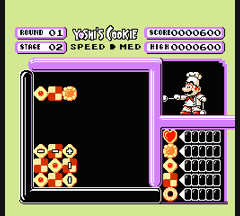
- **Working image links:** [snap](https://raw.githubusercontent.com/libretro-thumbnails/Nintendo_-_Nintendo_Entertainment_System/master/Named_Snaps/Yoshi%27s%20Cookie%20%28USA%29.png) · [title](https://raw.githubusercontent.com/libretro-thumbnails/Nintendo_-_Nintendo_Entertainment_System/master/Named_Titles/Yoshi%27s%20Cookie%20%28USA%29.png) · [boxart](https://raw.githubusercontent.com/libretro-thumbnails/Nintendo_-_Nintendo_Entertainment_System/master/Named_Boxarts/Yoshi%27s%20Cookie%20%28USA%29.png)

---

## 🟥 Sega Mega Drive / Genesis (MD)

### 🎮 Aerobiz
- **About:** Airline business simulator where you build routes worldwide.
- **How it plays:** Turn-based management: planes, routes, budgets, growth.
- **Getting started:** Open short high-demand routes first and keep aircraft utilization high before buying extra planes.
- **ByteBoi controls:** D-pad cursor, A confirm/action, B back, Start (Select+A) menu.
- **Animated GIF preview:** 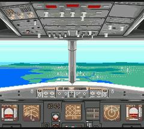
- **Working image links:** [snap](https://raw.githubusercontent.com/libretro-thumbnails/Sega_-_Mega_Drive_-_Genesis/master/Named_Snaps/Aerobiz%20%28USA%29.png) · [title](https://raw.githubusercontent.com/libretro-thumbnails/Sega_-_Mega_Drive_-_Genesis/master/Named_Titles/Aerobiz%20%28USA%29.png) · [boxart](https://raw.githubusercontent.com/libretro-thumbnails/Sega_-_Mega_Drive_-_Genesis/master/Named_Boxarts/Aerobiz%20%28USA%29.png)

### 🎮 Aerobiz Supersonic
- **About:** Bigger, deeper airline strategy game with world events.
- **How it plays:** Plan routes and finances while adapting to market changes.
- **Getting started:** Upgrade to newer aircraft for range/efficiency early, but keep cash reserve instead of over-expanding.
- **ByteBoi controls:** D-pad cursor, A confirm/action, B back, Start (Select+A) menu.
- **Animated GIF preview:** 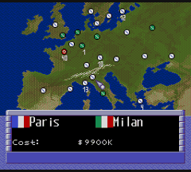
- **Working image links:** [snap](https://raw.githubusercontent.com/libretro-thumbnails/Sega_-_Mega_Drive_-_Genesis/master/Named_Snaps/Aerobiz%20Supersonic%20%28USA%29.png) · [title](https://raw.githubusercontent.com/libretro-thumbnails/Sega_-_Mega_Drive_-_Genesis/master/Named_Titles/Aerobiz%20Supersonic%20%28USA%29.png) · [boxart](https://raw.githubusercontent.com/libretro-thumbnails/Sega_-_Mega_Drive_-_Genesis/master/Named_Boxarts/Aerobiz%20Supersonic%20%28USA%29.png)

### 🎮 Columns
- **About:** Relaxing gem-matching puzzle classic.
- **How it plays:** Drop and rotate gem stacks to align 3+ colors.
- **Getting started:** Build flat stacks and set up diagonal clears; diagonal chains are safer than chasing only horizontal matches.
- **ByteBoi controls:** D-pad move, A/B rotate, Start (Select+A) pause.
- **Animated GIF preview:** 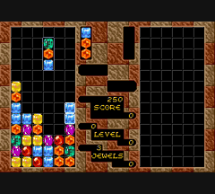
- **Working image links:** [snap](https://raw.githubusercontent.com/libretro-thumbnails/Sega_-_Mega_Drive_-_Genesis/master/Named_Snaps/Columns%20%28USA%2C%20Europe%29.png) · [title](https://raw.githubusercontent.com/libretro-thumbnails/Sega_-_Mega_Drive_-_Genesis/master/Named_Titles/Columns%20%28USA%2C%20Europe%29.png) · [boxart](https://raw.githubusercontent.com/libretro-thumbnails/Sega_-_Mega_Drive_-_Genesis/master/Named_Boxarts/Columns%20%28USA%2C%20Europe%29.png)

### 🎮 Dr. Robotnik's Mean Bean Machine
- **About:** Fast puzzle battles with colorful beans and chain combos.
- **How it plays:** Match beans to clear and dump junk on rivals.
- **Getting started:** Build staircase patterns to trigger 2-3 bean chains; chains matter more than single 4-bean clears.
- **ByteBoi controls:** D-pad move, A/B rotate, Start (Select+A) pause.
- **Animated GIF preview:** 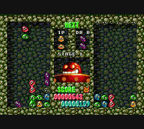
- **Working image links:** [snap](https://raw.githubusercontent.com/libretro-thumbnails/Sega_-_Mega_Drive_-_Genesis/master/Named_Snaps/Dr.%20Robotnik%27s%20Mean%20Bean%20Machine%20%28USA%29.png) · [title](https://raw.githubusercontent.com/libretro-thumbnails/Sega_-_Mega_Drive_-_Genesis/master/Named_Titles/Dr.%20Robotnik%27s%20Mean%20Bean%20Machine%20%28USA%29.png) · [boxart](https://raw.githubusercontent.com/libretro-thumbnails/Sega_-_Mega_Drive_-_Genesis/master/Named_Boxarts/Dr.%20Robotnik%27s%20Mean%20Bean%20Machine%20%28USA%29.png)

### 🎮 General Chaos
- **About:** Funny military tactics game with quick squad action.
- **How it plays:** Command units and attack at the right moments.
- **Getting started:** Keep squads grouped and focus fire one enemy team at a time rather than splitting targets.
- **ByteBoi controls:** D-pad move/cursor, A select/attack, B cancel/switch, Start (Select+A) pause.
- **Animated GIF preview:** 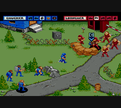
- **Working image links:** [snap](https://raw.githubusercontent.com/libretro-thumbnails/Sega_-_Mega_Drive_-_Genesis/master/Named_Snaps/General%20Chaos%20%28USA%2C%20Europe%29.png) · [title](https://raw.githubusercontent.com/libretro-thumbnails/Sega_-_Mega_Drive_-_Genesis/master/Named_Titles/General%20Chaos%20%28USA%2C%20Europe%29.png) · [boxart](https://raw.githubusercontent.com/libretro-thumbnails/Sega_-_Mega_Drive_-_Genesis/master/Named_Boxarts/General%20Chaos%20%28USA%2C%20Europe%29.png)

### 🎮 Lemmings 2 - The Tribes
- **About:** Puzzle rescue game for lots of tiny lemmings.
- **How it plays:** Assign skills to guide groups through hazards.
- **Getting started:** Pause at level start, assign one blocker near hazards, then route builders/diggers with remaining skills.
- **ByteBoi controls:** D-pad cursor, A assign skill, B cancel, Start (Select+A) pause.
- **Animated GIF preview:** 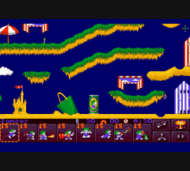
- **Working image links:** [snap](https://raw.githubusercontent.com/libretro-thumbnails/Sega_-_Mega_Drive_-_Genesis/master/Named_Snaps/Lemmings%202%20-%20The%20Tribes%20%28USA%29.png) · [title](https://raw.githubusercontent.com/libretro-thumbnails/Sega_-_Mega_Drive_-_Genesis/master/Named_Titles/Lemmings%202%20-%20The%20Tribes%20%28USA%29.png) · [boxart](https://raw.githubusercontent.com/libretro-thumbnails/Sega_-_Mega_Drive_-_Genesis/master/Named_Boxarts/Lemmings%202%20-%20The%20Tribes%20%28USA%29.png)

### 🎮 Mega-lo-Mania
- **About:** Strategy game about evolving civilization and conquering islands.
- **How it plays:** Gather resources, research tech, and command armies.
- **Getting started:** Mine all nearby resources first, then rush one strong army tech path before advancing ages.
- **ByteBoi controls:** D-pad cursor, A confirm/build, B back, Start (Select+A) menu.
- **Animated GIF preview:** 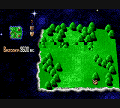
- **Working image links:** [snap](https://raw.githubusercontent.com/libretro-thumbnails/Sega_-_Mega_Drive_-_Genesis/master/Named_Snaps/Mega-lo-Mania%20%28Europe%29.png) · [title](https://raw.githubusercontent.com/libretro-thumbnails/Sega_-_Mega_Drive_-_Genesis/master/Named_Titles/Mega-lo-Mania%20%28Europe%29.png) · [boxart](https://raw.githubusercontent.com/libretro-thumbnails/Sega_-_Mega_Drive_-_Genesis/master/Named_Boxarts/Mega-lo-Mania%20%28Europe%29.png)

### 🎮 Phantasy Star IV
- **About:** Epic sci-fi/fantasy RPG story with cool heroes and battles.
- **How it plays:** Explore towns/dungeons and fight turn-based battles.
- **Getting started:** Fight a little extra near the starting towns and buy armor upgrades before the first major dungeons.
- **ByteBoi controls:** D-pad move/cursor, A confirm/talk, B cancel, Start (Select+A) menu.
- **Animated GIF preview:** 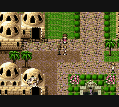
- **Working image links:** [snap](https://raw.githubusercontent.com/libretro-thumbnails/Sega_-_Mega_Drive_-_Genesis/master/Named_Snaps/Phantasy%20Star%20IV%20%28USA%29.png) · [title](https://raw.githubusercontent.com/libretro-thumbnails/Sega_-_Mega_Drive_-_Genesis/master/Named_Titles/Phantasy%20Star%20IV%20%28USA%29.png) · [boxart](https://raw.githubusercontent.com/libretro-thumbnails/Sega_-_Mega_Drive_-_Genesis/master/Named_Boxarts/Phantasy%20Star%20IV%20%28USA%29.png)

### 🎮 Populous
- **About:** “God game” where you shape land and guide your followers.
- **How it plays:** Raise/lower terrain, grow settlements, defeat rival civilization.
- **Getting started:** Flatten land around your first settlement immediately; bigger land means faster population growth and mana.
- **ByteBoi controls:** D-pad cursor/map, A confirm power, B back, Start (Select+A) menu.
- **Animated GIF preview:** 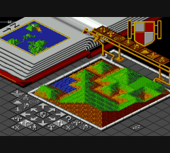
- **Working image links:** [snap](https://raw.githubusercontent.com/libretro-thumbnails/Sega_-_Mega_Drive_-_Genesis/master/Named_Snaps/Populous%20%28Europe%29.png) · [title](https://raw.githubusercontent.com/libretro-thumbnails/Sega_-_Mega_Drive_-_Genesis/master/Named_Titles/Populous%20%28Europe%29.png) · [boxart](https://raw.githubusercontent.com/libretro-thumbnails/Sega_-_Mega_Drive_-_Genesis/master/Named_Boxarts/Populous%20%28Europe%29.png)

### 🎮 Shining Force
- **About:** Tactical fantasy RPG with turn-based grid battles.
- **How it plays:** Move units smartly and use team roles for victory.
- **Getting started:** Feed last hits to underleveled members and delay promotion until higher levels for stronger long-term stats.
- **ByteBoi controls:** D-pad cursor/units, A confirm action, B cancel, Start (Select+A) battle menu.
- **Animated GIF preview:** 
- **Working image links:** [snap](https://raw.githubusercontent.com/libretro-thumbnails/Sega_-_Mega_Drive_-_Genesis/master/Named_Snaps/Shining%20Force%20%28USA%29.png) · [title](https://raw.githubusercontent.com/libretro-thumbnails/Sega_-_Mega_Drive_-_Genesis/master/Named_Titles/Shining%20Force%20%28USA%29.png) · [boxart](https://raw.githubusercontent.com/libretro-thumbnails/Sega_-_Mega_Drive_-_Genesis/master/Named_Boxarts/Shining%20Force%20%28USA%29.png)

### 🎮 Shining Force II (covers both ROM variants in folder)
- **About:** Bigger tactical RPG journey with a lovable hero team.
- **How it plays:** Turn-based strategy battles plus town exploration.
- **Getting started:** Search towns for hidden items on odd tiles and keep the team leveled evenly before tough battles.
- **ByteBoi controls:** D-pad cursor/units, A confirm, B cancel, Start (Select+A) menu.
- **Animated GIF preview:** 
- **Working image links:** [snap](https://raw.githubusercontent.com/libretro-thumbnails/Sega_-_Mega_Drive_-_Genesis/master/Named_Snaps/Shining%20Force%20II%20%28USA%29.png) · [title](https://raw.githubusercontent.com/libretro-thumbnails/Sega_-_Mega_Drive_-_Genesis/master/Named_Titles/Shining%20Force%20II%20%28USA%29.png) · [boxart](https://raw.githubusercontent.com/libretro-thumbnails/Sega_-_Mega_Drive_-_Genesis/master/Named_Boxarts/Shining%20Force%20II%20%28USA%29.png)

### 🎮 Starflight
- **About:** Space exploration game with mystery, crew management, and adventure.
- **How it plays:** Travel star systems, manage fuel/crew, and investigate planets.
- **Getting started:** Mine Arth early for minerals and install core ship upgrades before long-distance exploration.
- **ByteBoi controls:** D-pad cursor/ship, A confirm/action, B back, Start (Select+A) menu.
- **Animated GIF preview:** 
- **Working image links:** [snap](https://raw.githubusercontent.com/libretro-thumbnails/Sega_-_Mega_Drive_-_Genesis/master/Named_Snaps/Starflight%20%28USA%2C%20Europe%29%20%28Rev%20A%29.png) · [title](https://raw.githubusercontent.com/libretro-thumbnails/Sega_-_Mega_Drive_-_Genesis/master/Named_Titles/Starflight%20%28USA%2C%20Europe%29%20%28Rev%20A%29.png) · [boxart](https://raw.githubusercontent.com/libretro-thumbnails/Sega_-_Mega_Drive_-_Genesis/master/Named_Boxarts/Starflight%20%28USA%2C%20Europe%29%20%28Rev%20A%29.png)

### 🎮 Theme Park
- **About:** Build and run your own amusement park.
- **How it plays:** Place rides, set prices, and keep guests happy.
- **Getting started:** Open with a few cheap rides, toilets, food, and handymen first; guest happiness drives early profit.
- **ByteBoi controls:** D-pad cursor, A build/confirm, B back, Start (Select+A) menu.
- **Animated GIF preview:** 
- **Working image links:** [snap](https://raw.githubusercontent.com/libretro-thumbnails/Sega_-_Mega_Drive_-_Genesis/master/Named_Snaps/Theme%20Park%20%28USA%2C%20Europe%29%20%28En%2CFr%2CDe%2CEs%29.png) · [title](https://raw.githubusercontent.com/libretro-thumbnails/Sega_-_Mega_Drive_-_Genesis/master/Named_Titles/Theme%20Park%20%28USA%2C%20Europe%29%20%28En%2CFr%2CDe%2CEs%29.png) · [boxart](https://raw.githubusercontent.com/libretro-thumbnails/Sega_-_Mega_Drive_-_Genesis/master/Named_Boxarts/Theme%20Park%20%28USA%2C%20Europe%29%20%28En%2CFr%2CDe%2CEs%29.png)

---

## 🟪 Sega Game Gear (GG)

### 🎮 Baku Baku Animal
- **About:** Silly puzzle game where animals eat matching food blocks.
- **How it plays:** Drop pieces and create matching animal-food clears.
- **Getting started:** Memorize food pairs (dog-bone, panda-bamboo, etc.) and set up small chains instead of random drops.
- **ByteBoi controls:** D-pad move, A/B rotate, Start (Select+A) pause.
- **Animated GIF preview:** 
- **Working image links:** [snap](https://raw.githubusercontent.com/libretro-thumbnails/Sega_-_Game_Gear/master/Named_Snaps/Baku%20Baku%20Animal%20-%20Sekai%20Shiikugakari%20Senshu-ken%20%28Japan%29.png) · [title](https://raw.githubusercontent.com/libretro-thumbnails/Sega_-_Game_Gear/master/Named_Titles/Baku%20Baku%20Animal%20-%20Sekai%20Shiikugakari%20Senshu-ken%20%28Japan%29.png) · [boxart](https://raw.githubusercontent.com/libretro-thumbnails/Sega_-_Game_Gear/master/Named_Boxarts/Baku%20Baku%20Animal%20-%20Sekai%20Shiikugakari%20Senshu-ken%20%28Japan%29.png)

### 🎮 Castle of Illusion Starring Mickey Mouse
- **About:** Magical platform adventure where Mickey rescues Minnie.
- **How it plays:** Run, jump, and defeat enemies through themed worlds.
- **Getting started:** Use jump-and-bounce attacks on enemies and bosses, and collect diamonds to earn extra lives early.
- **ByteBoi controls:** D-pad move, A jump, B attack, Start (Select+A) pause.
- **Animated GIF preview:** 
- **Working image links:** [snap](https://raw.githubusercontent.com/libretro-thumbnails/Sega_-_Game_Gear/master/Named_Snaps/Castle%20of%20Illusion%20Starring%20Mickey%20Mouse%20%28USA%2C%20Europe%2C%20Brazil%29%20%28En%29.png) · [title](https://raw.githubusercontent.com/libretro-thumbnails/Sega_-_Game_Gear/master/Named_Titles/Castle%20of%20Illusion%20Starring%20Mickey%20Mouse%20%28USA%2C%20Europe%2C%20Brazil%29%20%28En%29.png) · [boxart](https://raw.githubusercontent.com/libretro-thumbnails/Sega_-_Game_Gear/master/Named_Boxarts/Castle%20of%20Illusion%20Starring%20Mickey%20Mouse%20%28USA%2C%20Europe%2C%20Brazil%29%20%28En%29.png)

### 🎮 Columns
- **About:** Chill jewel-matching puzzle game.
- **How it plays:** Match 3 same-color gems with falling columns.
- **Getting started:** Keep stacks low and rotate for diagonal matches; diagonals are often the easiest safe clears.
- **ByteBoi controls:** D-pad move, A/B rotate, Start (Select+A) pause.
- **Animated GIF preview:** 
- **Working image links:** [snap](https://raw.githubusercontent.com/libretro-thumbnails/Sega_-_Game_Gear/master/Named_Snaps/Columns%20%28Japan%29%20%28En%29%20%28Rev%20A%29.png) · [title](https://raw.githubusercontent.com/libretro-thumbnails/Sega_-_Game_Gear/master/Named_Titles/Columns%20%28Japan%29%20%28En%29%20%28Rev%20A%29.png) · [boxart](https://raw.githubusercontent.com/libretro-thumbnails/Sega_-_Game_Gear/master/Named_Boxarts/Columns%20%28Japan%29%20%28En%29%20%28Rev%20A%29.png)

### 🎮 Crystal Warriors
- **About:** Turn-based fantasy tactics with heroes and monsters.
- **How it plays:** Move units on maps and choose attacks strategically.
- **Getting started:** Use elemental advantage and terrain defense bonuses before attacking; positioning wins early maps.
- **ByteBoi controls:** D-pad cursor, A confirm, B cancel, Start (Select+A) menu.
- **Animated GIF preview:** 
- **Working image links:** [snap](https://raw.githubusercontent.com/libretro-thumbnails/Sega_-_Game_Gear/master/Named_Snaps/Crystal%20Warriors%20%28USA%2C%20Europe%29.png) · [title](https://raw.githubusercontent.com/libretro-thumbnails/Sega_-_Game_Gear/master/Named_Titles/Crystal%20Warriors%20%28USA%2C%20Europe%29.png) · [boxart](https://raw.githubusercontent.com/libretro-thumbnails/Sega_-_Game_Gear/master/Named_Boxarts/Crystal%20Warriors%20%28USA%2C%20Europe%29.png)

### 🎮 Defenders of Oasis
- **About:** Desert-themed JRPG story with a heroic party.
- **How it plays:** Explore towns/dungeons and fight in turn-based battles.
- **Getting started:** Recruit allies as soon as available and keep healing items stocked before entering long dungeons.
- **ByteBoi controls:** D-pad move/cursor, A confirm/talk, B back, Start (Select+A) menu.
- **Animated GIF preview:** 
- **Working image links:** [snap](https://raw.githubusercontent.com/libretro-thumbnails/Sega_-_Game_Gear/master/Named_Snaps/Defenders%20of%20Oasis%20%28USA%2C%20Europe%29%20%28Virtual%20Console%29.png) · [title](https://raw.githubusercontent.com/libretro-thumbnails/Sega_-_Game_Gear/master/Named_Titles/Defenders%20of%20Oasis%20%28USA%2C%20Europe%29%20%28Virtual%20Console%29.png) · [boxart](https://raw.githubusercontent.com/libretro-thumbnails/Sega_-_Game_Gear/master/Named_Boxarts/Defenders%20of%20Oasis%20%28USA%2C%20Europe%29%20%28Virtual%20Console%29.png)

### 🎮 Dr. Robotnik's Mean Bean Machine
- **About:** Fast bean-matching puzzle duels.
- **How it plays:** Connect same colors to clear and attack opponent board.
- **Getting started:** Practice staircase setups for chain reactions; one good chain can reset a losing board.
- **ByteBoi controls:** D-pad move, A/B rotate, Start (Select+A) pause.
- **Animated GIF preview:** 
- **Working image links:** [snap](https://raw.githubusercontent.com/libretro-thumbnails/Sega_-_Game_Gear/master/Named_Snaps/Dr.%20Robotnik%27s%20Mean%20Bean%20Machine%20%28USA%2C%20Europe%29.png) · [title](https://raw.githubusercontent.com/libretro-thumbnails/Sega_-_Game_Gear/master/Named_Titles/Dr.%20Robotnik%27s%20Mean%20Bean%20Machine%20%28USA%2C%20Europe%29.png) · [boxart](https://raw.githubusercontent.com/libretro-thumbnails/Sega_-_Game_Gear/master/Named_Boxarts/Dr.%20Robotnik%27s%20Mean%20Bean%20Machine%20%28USA%2C%20Europe%29.png)

### 🎮 Dragon Crystal
- **About:** Roguelike dungeon game with random floors and treasure.
- **How it plays:** Every step is a turn; survival and smart item use matter.
- **Getting started:** When health is low, take stairs immediately and identify items in safer rooms before risky fights.
- **ByteBoi controls:** D-pad move/cursor, A confirm/action, B back, Start (Select+A) menu.
- **Animated GIF preview:** 
- **Working image links:** [snap](https://raw.githubusercontent.com/libretro-thumbnails/Sega_-_Game_Gear/master/Named_Snaps/Dragon%20Crystal%20%28USA%2C%20Europe%29%20%28Virtual%20Console%29.png) · [title](https://raw.githubusercontent.com/libretro-thumbnails/Sega_-_Game_Gear/master/Named_Titles/Dragon%20Crystal%20%28USA%2C%20Europe%29%20%28Virtual%20Console%29.png) · [boxart](https://raw.githubusercontent.com/libretro-thumbnails/Sega_-_Game_Gear/master/Named_Boxarts/Dragon%20Crystal%20%28USA%2C%20Europe%29%20%28Virtual%20Console%29.png)

### 🎮 GG Aleste
- **About:** Super flashy space shooter.
- **How it plays:** Dodge bullets, collect power-ups, beat giant bosses.
- **Getting started:** Pick one weapon style you like and prioritize dodging lanes over chasing every enemy.
- **ByteBoi controls:** D-pad fly, A shoot, B special, Start (Select+A) pause.
- **Animated GIF preview:** 
- **Working image links:** [snap](https://raw.githubusercontent.com/libretro-thumbnails/Sega_-_Game_Gear/master/Named_Snaps/GG%20Aleste%20%28Japan%29%20%28En%29.png) · [title](https://raw.githubusercontent.com/libretro-thumbnails/Sega_-_Game_Gear/master/Named_Titles/GG%20Aleste%20%28Japan%29%20%28En%29.png) · [boxart](https://raw.githubusercontent.com/libretro-thumbnails/Sega_-_Game_Gear/master/Named_Boxarts/GG%20Aleste%20%28Japan%29%20%28En%29.png)

### 🎮 GG Aleste II
- **About:** Harder sequel with cooler weapon effects.
- **How it plays:** Fast shooting action with pattern-dodging and boss fights.
- **Getting started:** Save bombs for dense bullet waves or miniboss patterns; survival matters more than max damage early.
- **ByteBoi controls:** D-pad fly, A shoot, B special, Start (Select+A) pause.
- **Animated GIF preview:** 
- **Working image links:** [snap](https://raw.githubusercontent.com/libretro-thumbnails/Sega_-_Game_Gear/master/Named_Snaps/GG%20Aleste%20II%20%28Japan%29%20%28En%29%20%28Aleste%20Collection%29.png) · [title](https://raw.githubusercontent.com/libretro-thumbnails/Sega_-_Game_Gear/master/Named_Titles/GG%20Aleste%20II%20%28Japan%29%20%28En%29%20%28Aleste%20Collection%29.png) · [boxart](https://raw.githubusercontent.com/libretro-thumbnails/Sega_-_Game_Gear/master/Named_Boxarts/GG%20Aleste%20II%20%28Japan%29%20%28En%29%20%28Aleste%20Collection%29.png)

### 🎮 Land of Illusion Starring Mickey Mouse
- **About:** Storybook-style Mickey platform adventure.
- **How it plays:** Explore, jump, and solve light action puzzles.
- **Getting started:** Revisit earlier stages after new abilities to collect hidden upgrades and easier extra lives.
- **ByteBoi controls:** D-pad move, A jump, B attack/use, Start (Select+A) pause.
- **Animated GIF preview:** 
- **Working image links:** [snap](https://raw.githubusercontent.com/libretro-thumbnails/Sega_-_Game_Gear/master/Named_Snaps/Land%20of%20Illusion%20Starring%20Mickey%20Mouse%20%28USA%2C%20Europe%2C%20Brazil%29%20%28En%29.png) · [title](https://raw.githubusercontent.com/libretro-thumbnails/Sega_-_Game_Gear/master/Named_Titles/Land%20of%20Illusion%20Starring%20Mickey%20Mouse%20%28USA%2C%20Europe%2C%20Brazil%29%20%28En%29.png) · [boxart](https://raw.githubusercontent.com/libretro-thumbnails/Sega_-_Game_Gear/master/Named_Boxarts/Land%20of%20Illusion%20Starring%20Mickey%20Mouse%20%28USA%2C%20Europe%2C%20Brazil%29%20%28En%29.png)

### 🎮 Lemmings
- **About:** Save tiny lemmings with smart skill assignments.
- **How it plays:** Pick builder/digger/blocker jobs to guide the crowd.
- **Getting started:** Lower release rate at level start, then assign blockers to prevent mass losses while planning.
- **ByteBoi controls:** D-pad cursor, A assign skill, B cancel, Start (Select+A) pause.
- **Animated GIF preview:** 
- **Working image links:** [snap](https://raw.githubusercontent.com/libretro-thumbnails/Sega_-_Game_Gear/master/Named_Snaps/Lemmings%20%28World%29.png) · [title](https://raw.githubusercontent.com/libretro-thumbnails/Sega_-_Game_Gear/master/Named_Titles/Lemmings%20%28World%29.png) · [boxart](https://raw.githubusercontent.com/libretro-thumbnails/Sega_-_Game_Gear/master/Named_Boxarts/Lemmings%20%28World%29.png)

### 🎮 Ristar
- **About:** Colorful platformer where a stretchy star hero saves planets.
- **How it plays:** Grab enemies/handles, swing, and move through action stages.
- **Getting started:** Use grab-then-headbutt rhythm on enemies and check side paths for hidden stars and health pickups.
- **ByteBoi controls:** D-pad move, A jump, B grab/attack, Start (Select+A) pause.
- **Animated GIF preview:** 
- **Working image links:** [snap](https://raw.githubusercontent.com/libretro-thumbnails/Sega_-_Game_Gear/master/Named_Snaps/Ristar%20%28World%29.png) · [title](https://raw.githubusercontent.com/libretro-thumbnails/Sega_-_Game_Gear/master/Named_Titles/Ristar%20%28World%29.png) · [boxart](https://raw.githubusercontent.com/libretro-thumbnails/Sega_-_Game_Gear/master/Named_Boxarts/Ristar%20%28World%29.png)

### 🎮 Royal Stone - Hirakareshi Toki no Tobira
- **About:** Deep tactical RPG with fantasy battles.
- **How it plays:** Turn-based map combat focused on positioning and team strategy.
- **Getting started:** Move as a tight formation and focus enemy healers/ranged units first to stabilize early battles.
- **ByteBoi controls:** D-pad cursor, A confirm, B cancel, Start (Select+A) menu.
- **Animated GIF preview:** 
- **Working image links:** [snap](https://raw.githubusercontent.com/libretro-thumbnails/Sega_-_Game_Gear/master/Named_Snaps/Royal%20Stone%20-%20Hirakareshi%20Toki%20no%20Tobira%20%28Japan%29.png) · [title](https://raw.githubusercontent.com/libretro-thumbnails/Sega_-_Game_Gear/master/Named_Titles/Royal%20Stone%20-%20Hirakareshi%20Toki%20no%20Tobira%20%28Japan%29.png) · [boxart](https://raw.githubusercontent.com/libretro-thumbnails/Sega_-_Game_Gear/master/Named_Boxarts/Royal%20Stone%20-%20Hirakareshi%20Toki%20no%20Tobira%20%28Japan%29.png)

### 🎮 Shining Force - The Sword of Hajya
- **About:** Tactical RPG adventure against dark magic.
- **How it plays:** Move heroes on a grid and use class strengths.
- **Getting started:** Use Egress to retreat from bad fights; you keep experience and can retry stronger.
- **ByteBoi controls:** D-pad cursor/units, A confirm action, B cancel, Start (Select+A) battle menu.
- **Animated GIF preview:** 
- **Working image links:** [snap](https://raw.githubusercontent.com/libretro-thumbnails/Sega_-_Game_Gear/master/Named_Snaps/Shining%20Force%20-%20The%20Sword%20of%20Hajya%20%28USA%2C%20Europe%29%20%28Virtual%20Console%29.png) · [title](https://raw.githubusercontent.com/libretro-thumbnails/Sega_-_Game_Gear/master/Named_Titles/Shining%20Force%20-%20The%20Sword%20of%20Hajya%20%28USA%2C%20Europe%29%20%28Virtual%20Console%29.png) · [boxart](https://raw.githubusercontent.com/libretro-thumbnails/Sega_-_Game_Gear/master/Named_Boxarts/Shining%20Force%20-%20The%20Sword%20of%20Hajya%20%28USA%2C%20Europe%29%20%28Virtual%20Console%29.png)

### 🎮 Shining Force Gaiden - Final Conflict
- **About:** Story-heavy tactical sequel with big battles.
- **How it plays:** Turn-by-turn team combat with magic and unit growth.
- **Getting started:** Leverage ranged attacks from safe tiles and rotate injured units to the back.
- **ByteBoi controls:** D-pad cursor/units, A confirm, B cancel, Start (Select+A) menu.
- **Animated GIF preview:** 
- **Working image links:** [snap](https://raw.githubusercontent.com/libretro-thumbnails/Sega_-_Game_Gear/master/Named_Snaps/Shining%20Force%20Gaiden%20-%20Final%20Conflict%20%28Japan%29.png) · [title](https://raw.githubusercontent.com/libretro-thumbnails/Sega_-_Game_Gear/master/Named_Titles/Shining%20Force%20Gaiden%20-%20Final%20Conflict%20%28Japan%29.png) · [boxart](https://raw.githubusercontent.com/libretro-thumbnails/Sega_-_Game_Gear/master/Named_Boxarts/Shining%20Force%20Gaiden%20-%20Final%20Conflict%20%28Japan%29.png)

### 🎮 Sylvan Tale
- **About:** Charming fantasy action-adventure with fairy-world vibes.
- **How it plays:** Explore top-down areas, fight, and solve simple puzzles.
- **Getting started:** Experiment with each transformation in new zones; form abilities unlock many hidden routes.
- **ByteBoi controls:** D-pad move, A attack/use, B magic/item, Start (Select+A) menu.
- **Animated GIF preview:** 
- **Working image links:** [snap](https://raw.githubusercontent.com/libretro-thumbnails/Sega_-_Game_Gear/master/Named_Snaps/Sylvan%20Tale%20%28Japan%29.png) · [title](https://raw.githubusercontent.com/libretro-thumbnails/Sega_-_Game_Gear/master/Named_Titles/Sylvan%20Tale%20%28Japan%29.png) · [boxart](https://raw.githubusercontent.com/libretro-thumbnails/Sega_-_Game_Gear/master/Named_Boxarts/Sylvan%20Tale%20%28Japan%29.png)

### 🎮 Tails Adventure
- **About:** Gadget-based Sonic-world adventure starring Tails.
- **How it plays:** Explore stages, unlock gadgets, and revisit for secrets.
- **Getting started:** Save bombs and special tools for breakable walls and locks, then backtrack to open new map branches.
- **ByteBoi controls:** D-pad move, A jump/fly, B item, Start (Select+A) pause.
- **Animated GIF preview:** 
- **Working image links:** [snap](https://raw.githubusercontent.com/libretro-thumbnails/Sega_-_Game_Gear/master/Named_Snaps/Tails%20Adventure%20%28World%29%20%28En%2CJa%29.png) · [title](https://raw.githubusercontent.com/libretro-thumbnails/Sega_-_Game_Gear/master/Named_Titles/Tails%20Adventure%20%28World%29%20%28En%2CJa%29.png) · [boxart](https://raw.githubusercontent.com/libretro-thumbnails/Sega_-_Game_Gear/master/Named_Boxarts/Tails%20Adventure%20%28World%29%20%28En%2CJa%29.png)

---

## 🌟 Super-Quick “Start Tonight” Picks

If you want instant fun with low stress, try:

1. **Mario’s Picross** (GB)  
2. **Pokemon Trading Card Game** (GBC)  
3. **Harvest Moon GBC** (GBC)  
4. **Shining Force** (MD)  
5. **Defenders of Oasis** (GG)

---

## 🧡 Final Notes

- This handbook covers all games currently in your ROM folders (with duplicate ROM variants grouped where appropriate, like Shining Force II).
- Screenshot links go to game screenshot pages so you can browse safely.
- Have fun and take breaks — games are for joy! ✨
