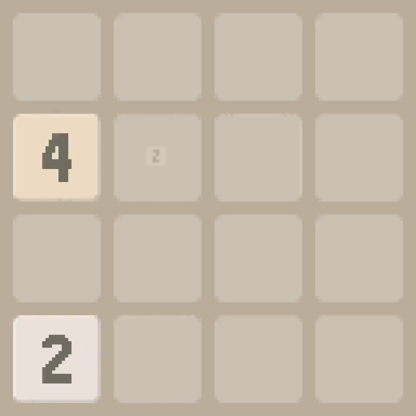
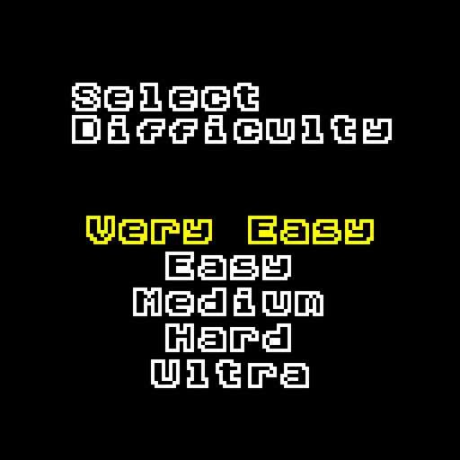
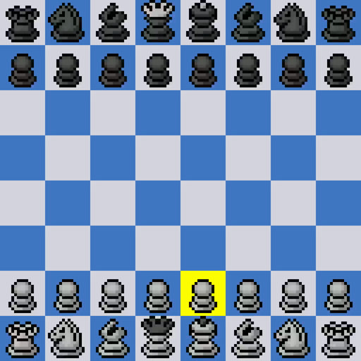
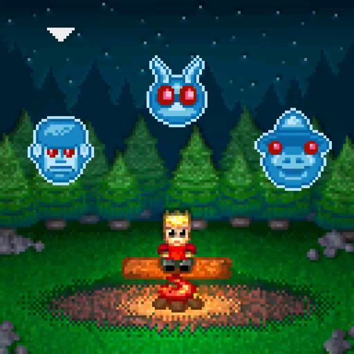
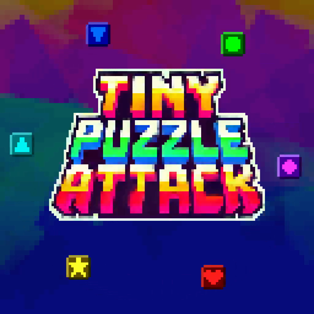
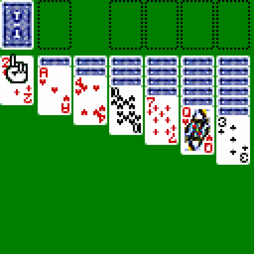
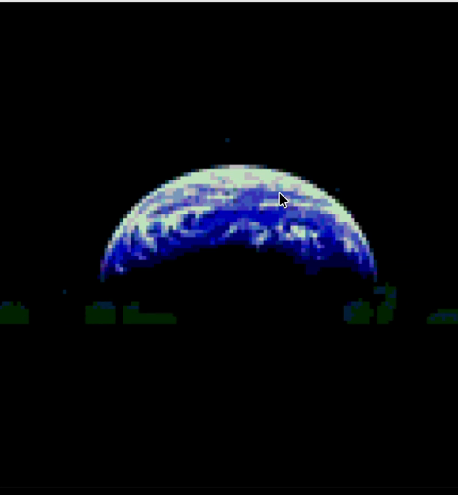
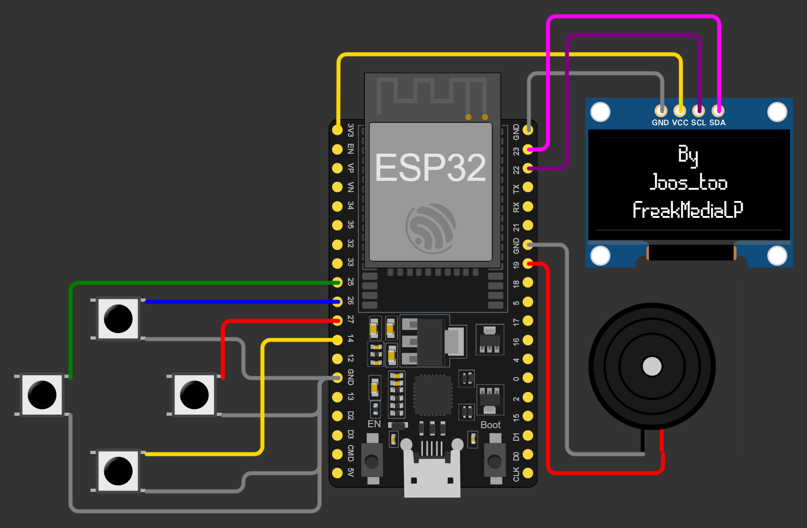

# Deep Catalog: MicroPython Games Portable to CircuitMess Codee

Updated: 2026-02-14

Target assumptions (Codee): ESP32-S3, 128x128 color display, 4 buttons (A/B/C/D), buzzer.

## Portability rubric
- `Low`: mostly API adaptation (display/input/audio wrappers).
- `Medium`: game logic ports cleanly, but input/UI scaling changes needed.
- `High`: significant control/UI/runtime adaptation needed.

## Tier 1: Best near-term ports (color handheld style)

| Game | Source | Why it maps to Codee | Port effort | Screenshot |
|---|---|---|---|---|
| 2048 | [TinyCircuits-Thumby-Color-Games](https://github.com/TinyCircuits/TinyCircuits-Thumby-Color-Games) | Grid game; simple directional controls; no precision timing dependencies. | Low |  |
| 4Connect | [TinyCircuits-Thumby-Color-Games](https://github.com/TinyCircuits/TinyCircuits-Thumby-Color-Games) | Turn-based, low input complexity; color UI transfers well. | Low |  |
| Chess | [TinyCircuits-Thumby-Color-Games](https://github.com/TinyCircuits/TinyCircuits-Thumby-Color-Games) | Turn-based board game; button navigation is straightforward. | Low |  |
| ComboPool | [TinyCircuits-Thumby-Color-Games](https://github.com/TinyCircuits/TinyCircuits-Thumby-Color-Games) | Arcade physics, but limited controls and 2D rendering. | Medium |  |
| FroggyRoad | [TinyCircuits-Thumby-Color-Games](https://github.com/TinyCircuits/TinyCircuits-Thumby-Color-Games) | Grid/lane movement gameplay maps cleanly to 4 buttons. | Low |  |
| Monstra | [TinyCircuits-Thumby-Color-Games](https://github.com/TinyCircuits/TinyCircuits-Thumby-Color-Games) | Action game with compact scene sizes and portable loop patterns. | Medium |  |
| PuzzleAttack | [TinyCircuits-Thumby-Color-Games](https://github.com/TinyCircuits/TinyCircuits-Thumby-Color-Games) | Tile logic + predictable frame loop; easy to map controls. | Medium |  |
| Solitaire | [TinyCircuits-Thumby-Color-Games](https://github.com/TinyCircuits/TinyCircuits-Thumby-Color-Games) | Turn-based; minimal latency pressure; easy persistence model. | Low |  |
| Tetrumb | [TinyCircuits-Thumby-Color-Games](https://github.com/TinyCircuits/TinyCircuits-Thumby-Color-Games) | Falling-block mechanics are portable and proven on constrained hardware. | Low |  |
| ThumbCommander | [TinyCircuits-Thumby-Color-Games](https://github.com/TinyCircuits/TinyCircuits-Thumby-Color-Games) | Menu/selection-heavy flow is adaptable to Codee controls. | Medium |  |
| ThumbSweeper | [TinyCircuits-Thumby-Color-Games](https://github.com/TinyCircuits/TinyCircuits-Thumby-Color-Games) | Minesweeper-like logic; deterministic and easy to test. | Low |  |
| WallRacerC | [TinyCircuits-Thumby-Color-Games](https://github.com/TinyCircuits/TinyCircuits-Thumby-Color-Games) | Fast arcade loop but simple input/state model. | Medium |  |

## Tier 2: Good candidates from Thumby mono catalog (upscale/adapt UI)

| Game | Source | Why it maps to Codee | Port effort | Screenshot |
|---|---|---|---|---|
| 3D_MAZE | [TinyCircuits-Thumby-Games](https://github.com/TinyCircuits/TinyCircuits-Thumby-Games) | Existing 3D-ish movement loop portable; needs control remap. | Medium |  |
| AppleTree | [TinyCircuits-Thumby-Games](https://github.com/TinyCircuits/TinyCircuits-Thumby-Games) | Simple catch/avoid loop; excellent first monochrome upscale. | Low |  |
| BurnsBrickBreaker | [TinyCircuits-Thumby-Games](https://github.com/TinyCircuits/TinyCircuits-Thumby-Games) | Classic paddle/ball model; easy audio mapping. | Low |  |
| Dance! | [TinyCircuits-Thumby-Games](https://github.com/TinyCircuits/TinyCircuits-Thumby-Games) | Rhythm/control loop likely maps to 4-way input. | Medium |  |
| FishPond | [TinyCircuits-Thumby-Games](https://github.com/TinyCircuits/TinyCircuits-Thumby-Games) | Lower-action gameplay with small state footprint. | Low |  |
| Floppy | [TinyCircuits-Thumby-Games](https://github.com/TinyCircuits/TinyCircuits-Thumby-Games) | Flappy-style loop; trivial button mapping. | Low |  |
| PicoBomb | [TinyCircuits-Thumby-Games](https://github.com/TinyCircuits/TinyCircuits-Thumby-Games) | Arcade single-screen logic; compact and testable. | Medium |  |
| Simple-Cookie-Clicker | [TinyCircuits-Thumby-Games](https://github.com/TinyCircuits/TinyCircuits-Thumby-Games) | UI/menu-heavy, low rendering complexity. | Low |  |
| SlotMachine | [TinyCircuits-Thumby-Games](https://github.com/TinyCircuits/TinyCircuits-Thumby-Games) | Turn/animation-based logic; easy display abstraction. | Low |  |
| TicTac | [TinyCircuits-Thumby-Games](https://github.com/TinyCircuits/TinyCircuits-Thumby-Games) | Very low-complexity board game; ideal smoke-test port. | Low |  |
| TinyFrog | [TinyCircuits-Thumby-Games](https://github.com/TinyCircuits/TinyCircuits-Thumby-Games) | Movement-heavy but simple state; good for input repeat tuning. | Medium |  |
| Tinynvaders | [TinyCircuits-Thumby-Games](https://github.com/TinyCircuits/TinyCircuits-Thumby-Games) | Shooter loop portable; needs fire/move mapping decisions. | Medium |  |

## Tier 3: Additional ESP32 MicroPython game sources worth mining

| Game/Project | Source | Why it maps to Codee | Port effort | Screenshot |
|---|---|---|---|---|
| Snake (Microsnake) | [joos-too/Microsnake](https://github.com/joos-too/Microsnake) | Native ESP32 + MicroPython + 4 direction buttons + optional buzzer. | Low |  |
| ClickFrenzy | [dagabi/esp32-game](https://github.com/dagabi/esp32-game) | ESP32 MicroPython loop with buzzer/button flow; easy to adapt to Codee UX. | Low |  |
| Single Button Game | [itay-mal/single_button_game](https://github.com/itay-mal/single_button_game) | Good source for one-button mechanics and timing systems on ESP32. | Medium |  |
| Catch the Stars | [gliber/esp32_catch_the_stars](https://github.com/gliber/esp32_catch_the_stars) | ESP32 + buzzer + SSD1306 game structure; adaptable gameplay core. | Medium |  |
| Breakout (sample) | [cheungbx/gameESP-micropython](https://github.com/cheungbx/gameESP-micropython) | Existing MicroPython game sample with reusable helper APIs. | Medium |  |
| Invader (sample) | [cheungbx/gameESP-micropython](https://github.com/cheungbx/gameESP-micropython) | Arcade loop patterns for constrained ESP boards. | Medium |  |
| Pong (sample) | [cheungbx/gameESP-micropython](https://github.com/cheungbx/gameESP-micropython) | Simple physics and frame pacing; good early integration target. | Low |  |
| Snake (sample) | [cheungbx/gameESP-micropython](https://github.com/cheungbx/gameESP-micropython) | Simple input/render/audio testbed for Codee adapter layer. | Low |  |
| BreakoutO (Odroid-Go) | [cheungbx/Odroid-Go-Micropython-games](https://github.com/cheungbx/Odroid-Go-Micropython-games) | ESP32 color-game logic from a handheld class device. | Medium |  |
| InvaderO (Odroid-Go) | [cheungbx/Odroid-Go-Micropython-games](https://github.com/cheungbx/Odroid-Go-Micropython-games) | Reusable color sprite/game loop patterns for ESP32. | Medium |  |
| ESP Arcade Playground (Dodge/Collect Stars/Zombie) | [snacsnoc/ESP-arcade-playground](https://github.com/snacsnoc/ESP-arcade-playground) | Multi-game menu architecture already built for ESP + MicroPython. | Medium |  |
| Silicon8 (CHIP-8 interpreter) | [Timendus/thumby-silicon8](https://github.com/Timendus/thumby-silicon8) | Not a single game, but opens many ROM-based mini games after adaptation. | High |  |

## Repo freshness and license snapshot (for planning)

| Repo | Last push (UTC) | SPDX license (GitHub metadata) |
|---|---|---|
| TinyCircuits-Thumby-Color-Games | 2026-02-09T15:23:53Z | NOASSERTION |
| TinyCircuits-Thumby-Games | 2026-02-10T16:14:32Z | NOASSERTION |
| gameESP-micropython | 2021-07-20T09:17:34Z | NOASSERTION |
| Odroid-Go-Micropython-games | 2019-11-16T10:03:29Z | NOASSERTION |
| ESP-arcade-playground | 2024-11-07T09:31:00Z | GPL-3.0 |
| thumby-silicon8 | 2022-09-09T12:20:55Z | GPL-3.0 |
| Thumby-Virtual-Pet | 2022-10-04T17:37:23Z | NOASSERTION |
| Microsnake | 2024-06-25T19:26:04Z | NOASSERTION |
| single_button_game | 2024-03-06T23:48:12Z | NOASSERTION |
| esp32-game | 2024-03-20T09:57:17Z | NOASSERTION |
| esp32_catch_the_stars | 2024-04-08T15:03:58Z | MIT |

## Notes
- `NOASSERTION` means license must be checked manually before redistribution.
- Most Thumby games are monochrome-oriented; Codee ports should run gameplay internally at source resolution and upscale into 128x128.
- Color Thumby titles are generally the fastest path for polished Codee results.

## Sources searched
- https://github.com/TinyCircuits/TinyCircuits-Thumby-Color-Games
- https://github.com/TinyCircuits/TinyCircuits-Thumby-Games
- https://github.com/cheungbx/gameESP-micropython
- https://github.com/cheungbx/Odroid-Go-Micropython-games
- https://github.com/snacsnoc/ESP-arcade-playground
- https://github.com/Timendus/thumby-silicon8
- https://github.com/SarahBass/Thumby-Virtual-Pet
- https://github.com/joos-too/Microsnake
- https://github.com/itay-mal/single_button_game
- https://github.com/dagabi/esp32-game
- https://github.com/gliber/esp32_catch_the_stars
- GitHub Search API (`/search/repositories`) with query variants around `micropython`, `esp32`, `thumby`, `game`.
