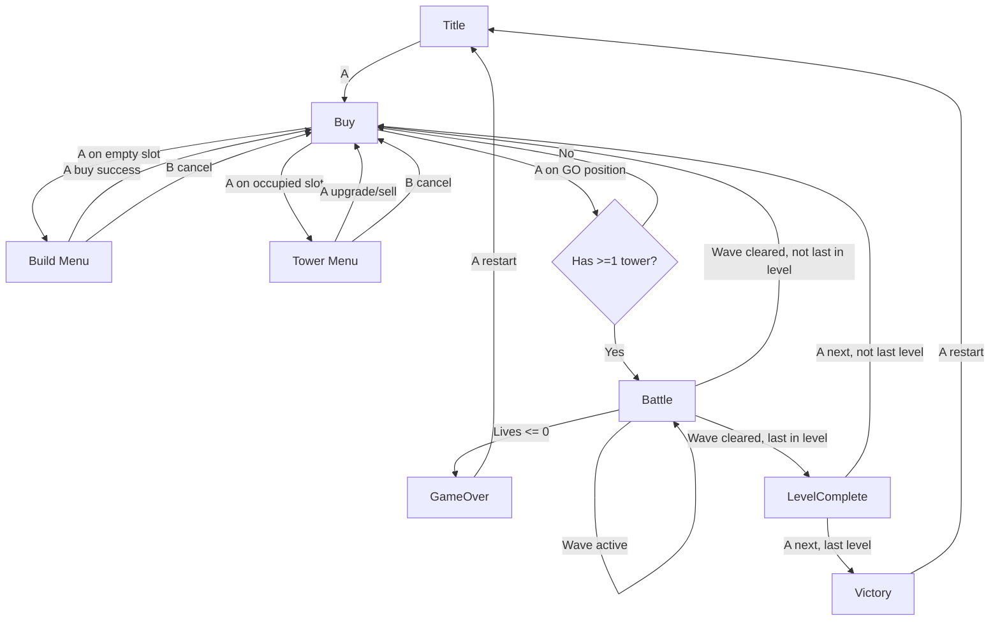

# Tower Defense Implementation (BIT Firmware)

This is a concise guide to the current Tower Defense implementation in:

- `third_party/Bit-Firmware/main/src/Games/TowerDefense/TDData.h/.cpp`
- `third_party/Bit-Firmware/main/src/Games/TowerDefense/TDLogic.h/.cpp`
- `third_party/Bit-Firmware/main/src/Games/TowerDefense/TowerDefense.h/.cpp`

## 1) Architecture (Data / Calculations / Actions)

- **Data layer (`TDData`)**: all inert types and constants (state, tower stats, level/wave definitions, palette, enums).
- **Calculations layer (`TDLogic`)**: pure state transition function:
  - `step(currentState, justPressed, heldButtons, dt) -> StepResult{ nextState, events }`
  - no rendering/audio/input side effects
- **Actions layer (`TowerDefense`)**: firmware integration:
  - maps `Input::Data` to 4-button snapshots
  - calls pure `step(...)`
  - renders state to canvas
  - plays chirp sounds from emitted logic events

```mermaid
flowchart LR
    I[Input::Data events] --> A[Actions: TowerDefense::handleInput]
    A --> S1[justPressed + held snapshots]
    S1 --> L[Pure Logic: TD::step(state, justPressed, held, dt)]
    L --> S2[next State]
    L --> E[Audio Events]
    S2 --> R[Actions: drawState(canvas)]
    E --> C[Actions: playAudioEvents(ChirpSystem)]
```

## 2) Current phase flow

`Title -> Buy -> Battle -> LevelComplete -> Victory | GameOver`

- **Buy**:
  - cursor moves over **buy positions** (all slots + left/right GO buttons)
  - empty slot: open build menu
  - occupied slot: open tower menu (upgrade/sell)
  - GO button starts battle only if at least one tower exists
- **Battle**:
  - enemies spawn by wave entries
  - towers auto-target nearest enemy in range
  - projectiles travel and apply damage
  - leaks reduce lives

### Buy/Battle transition diagram



## 3) How maps are generated now

Maps are **authored as char grids** in `TDData.cpp` (`LevelDefinition.rows`, 20x8):

- `.` grass
- `#` path
- `s` slot candidate
- `S` start
- `E` end

Derived runtime geometry is built once in `TDLogic::buildDerived(...)`:

1. Parse `S`, `E`, and slot candidates
2. Keep only slots adjacent to path/start/end tiles
3. Trace ordered path tiles from `S` to `E`
4. Build buy positions:
   - synthetic GO-left
   - all valid slots (sorted by X then Y)
   - synthetic GO-right

## 4) Controls (4-button model)

- **Left/Right**: navigate cursor / menu choices
- **A**: accept
- **B**: cancel/back
- During battle, held Left/Right scroll camera

## 5) Themes and levels

- **Levels**: add/modify `LevelDefinition` entries in `TDData.cpp` (`rows` + `waves`)
- **Themes**: currently one palette set in `TDData.h` (`namespace Palette`)
  - easiest extension: define multiple palette structs and pick one by `levelIndex` (or a theme index in `State`)
